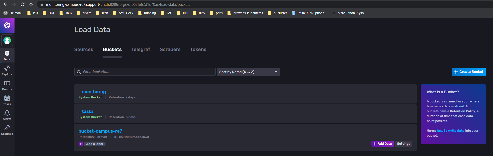
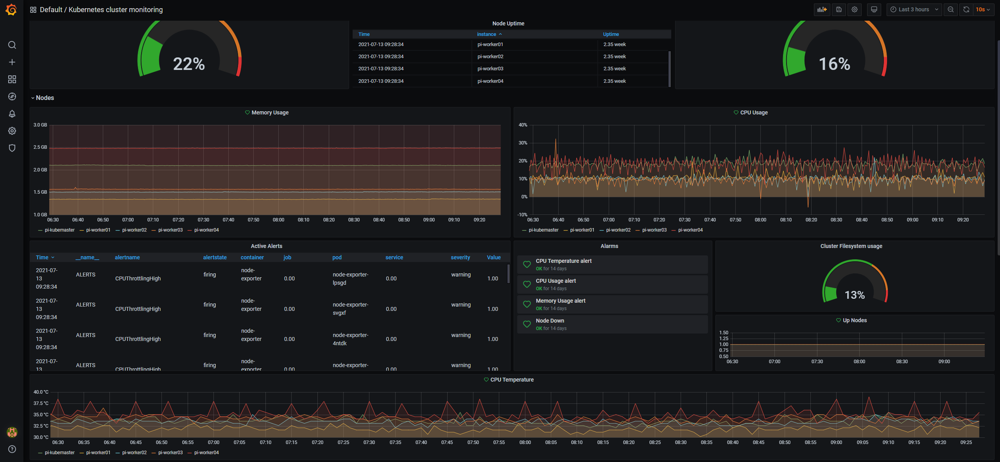
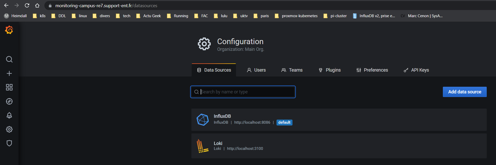
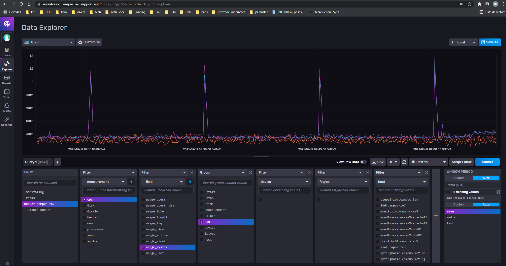
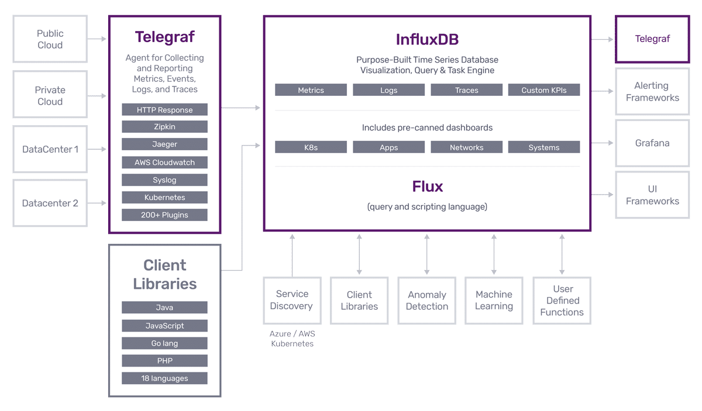
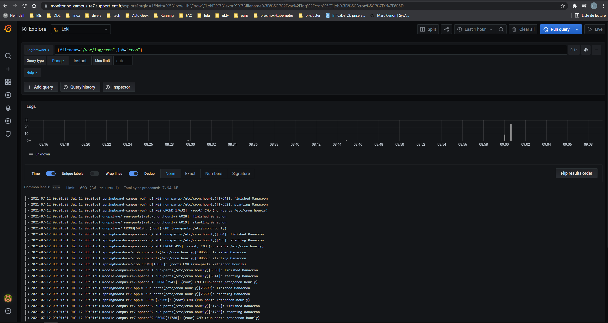
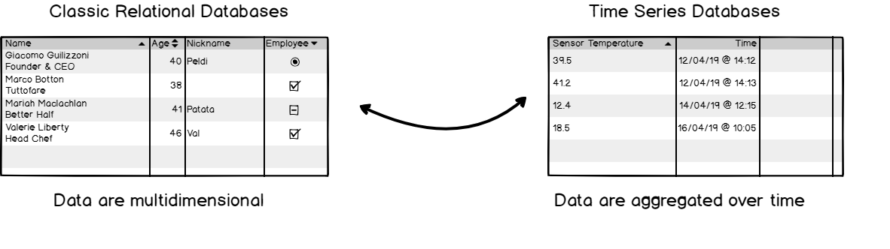

# Automatisation dans un S.I
Marc Cenon

Stage du 12/04/2021 au 31/12/2021

web: https://marc-cenon.github.io/my_resume/

mail: marc.cenon33@gmail.com

# Table des matieres

- [Remerciements](#remerciements)
- [Introduction](#introduction)
- [Partie 1](#partie-1)
  * [Présentation de CGI](#pr-sentation-de-cgi)
  * [Le contexte de travail](#le-contexte-de-travail)
  * [Mes missions](#mes-missions)
- [Partie 2](#partie-2)
  * [Ansible et Automatisation](#ansible-et-automatisation)
  * [La solution de monitoring](#la-solution-de-monitoring)
  * [La stack de monitoring](#la-stack-de-monitoring)
    + [Telegraf](#telegraf)
    + [Influxdb](#influxdb)
    + [Loki](#loki)
    + [Promtail](#promtail)
    + [Grafana](#grafana)
    + [Mise en place des différents éléments](#mise-en-place-des-différents-éléments)
    + [Infrastrucre à surveiller](#infrastrucre-à-surveiller)
    + [Installation d'Ansible](#installation-d-ansible)
      - [Concepts de base](#concepts-de-base)
  * [Le Playbook](#le-playbook)
    + [Organisation](#organisation)
    + [Les différents rôles](#les-différents-rôles)
      - [Grafana](#grafana-1)
      - [Influxdb](#influxdb-1)
      - [Telegraf](#telegraf-1)
      - [Promtail](#promtail-1)
      - [Loki](#loki-1)
    + [Le fichier playbook.yml](#le-fichier-playbookyml)
    + [le fichier host.yml](#le-fichier-hostyml)
    + [Utilisation du langage Flux avec Influxdb](#utilisation-du-langage-flux-avec-influxdb)
    + [Exemple de configuration de Promtail.](#exemple-de-configuration-de-promtail)
    + [Ajout des datastores dans Grafana](#ajout-des-datastores-dans-grafana)
    + [Importation du dashboard](#importation-du-dashboard)
    + [Utilisation de Grafana](#utilisation-de-grafana)
    + [Conclusion sur ce projet](#conclusion-sur-ce-projet)
- [Conclusion](#conclusion)
- [Annexes](#annexes)


# Remerciements

Je tiens à remercier en premier lieu toute l'équipe Infra de CGI pour son accueil chaleureux, tout particulièrement **Mr. Thomas Colenos**, **Mr. Arthur Bertinetti** et **Mr Laurent Poutou** pour leur patience et leur grande pédagogie. J'ai pu ainsi bénéficier de leur grande expérience, ce qui m'a permis d'avoir une bonne monté en compétence.

En effet, chacune des personnes de l'équipe a su me consacre du temps et partager avec moi leur expertise, méthodes et connaissances tout au long de ce stage. Ils m’ont permis de rendre cette expérience de 6 mois enrichissante et pleine d'intérêt.

J'ai énormément appris. Ils m'ont fait confiance pour travailler avec eux sur pleins de projets et avec une grande autonomie.

Je les remercie également pour la bonne humeur et les temps de rigolade qu'ils ont su me communiquer et l'envie qu'ils m'ont donné de travailler au sein de leur équipe.

Je tiens à remercier également le corps enseignant de l'université, notamment **Mr Samuel Thibault** et **Mr Olivier Delmas** pour leurs soutien et leurs enseignements.


# Introduction

Dans le cadre de la Licence professionnelle ADSILLH, j'ai effectué un stage de 6 mois au sein de l'équipe TPSHR Infra chez CGI. Dans ce rapport, je vais vous présenter l'entreprise qui m'a accueilli et plus précisément l'équipe où j'ai réalisé mon stage. Vous trouverez dans les annexes un tableau qui récapitules les taches sur lesquelles j'ai travaillé, semaine par semaine.

Etant donné la diversité des taches réalisées, j'ai choisi comme thème de rapport de stage l'automatisation dans un S.I avec un focus sur le déploiement d'une stack de monitoring.

Aucunes données confidentielles ne sera présenté dans ce rapport.

Le but de ce stage était d'intégrer l'équipe Infrastructure afin de participer au développement du numérique à l'école ainsi que sur la gestion de cette infrastructure. Ce stage m'a permis d'apprendre et de manipuler des technologies comme Ansible, vSphere, Jira, Confluence, Kubernetes, Python, Mariadb, Postgresql, ...

Au-delà du gain en compétences techniques, l'immersion au sein d'un processus de gestion de projet m'a appris à reconnaitre et interagir avec chacune des phases du projet sur le terrain. Cette immersion au sein d'un environnement complexe m'a également appris à être plus efficace, que ce soit par le biais d'une meilleure gestion de mon temps ou encore une meilleure communication sur l'avancement de mes taches auprès de l'équipe que j'ai intégré.


# Partie 1
## Présentation de CGI

Fondé en juin 1976 par Serge Godin à Québec, Canada, CGI est un groupe canadien actif dans le domaine des technologies de l’information et en gestion des processus d’affaires. Au cours des dix premières années d’existence, CGI a développé une stratégie, un modèle et un ensemble de principes de gestion qui se sont traduits par une croissance considérable. Devant les demandes des clients d’externaliser leurs systèmes informatiques, CGI s'est adapté et à élaborer une nouvelle stratégie pour se positionner sur le marché émergent de l’externalisation.

Durant la fin des années 80 et début 90, CGI commença à acquérir des sociétés proposant des services d’externalisation. Dès lors, CGI est en mesure d’offrir à ses clients des services informatiques complets tels que des services en TI (Technologies de l’Information) et en gestion, des services d’intégrations de système et d’externalisation.

Dans les 20 dernières années, CGI chercha à atteindre une taille critique sur les marchés géographiques de ses clients, d’acquérir une croissance approfondie de leurs secteurs d’activités ainsi que de développer des pratiques spécialisées et des solutions novatrices.
En 2010, CGI fait l’acquisition de Stanley Inc. et de ses filiales Oberon et Techrizon dans le but de doubler la taille de ses activités aux États-Unis. Deux années plus tard, CGI réalisa sa plus grosse acquisition en fusionnant avec l’entreprise Logica faisant passer son nombre de collaborateurs de 31 000 à 68000.

Au cours de son histoire, CGI a réussi une expansion exponentielle et continue pendant 35 ans grâce à une stratégie de rachat et de conquête des différents marchés comme en témoigne le tableau ci-joint en Annexe relatant sa forte croissance en chiffre d’affaires, en nombre de bureaux et en nombre d’employés.

CGI est l'un des leaders mondiaux du conseil et des services numériques. Avec plus de 40 ans d'expertise et de savoir-faire et présent dans plus de 40 pays, le groupe CGI est implanté dans 21 villes en France avec environs 11 000 salariés.


L’entreprise est actuellement dirigée par trois personnes :
- Serge Godin : Fondateur et président exécutif du conseil,
- André Imbeau : Fondateur et membre du conseil d’administration,
- George D. Schindler : Président et chef de la direction.

Avec une présence dans 40 pays, une solide expertise dans tous ses marchés cibles et un éventail complet de service en IT, la priorité de CGI reste de satisfaire ses clients. Grace à une approche cohérente, disciplinée et responsable en matière de prestation de services, CGI affiche un bilan inégalé de 95% de projets réalisés dans le respect des échéances prévues et affiche un indice de satisfaction des clients qui est constamment supérieur à 9 sur 10. Ce score de satisfaction couplé à la croissance continue de CGI témoigne de la confiance que ses clients accordent à CGI et du dévouement de ses collaborateurs. 

Ceci dans le but de devenir un fournisseur de services complets, d’atteindre des résultats grâce à des ressources mondiales, à une connaissance approfondie de l’industrie, à une stabilité et des professionnels motivés. CGI possède maintenant 6 domaines d’expertises métiers qui sont le Business Consulting, l’intégration de systèmes, l’Outsourcing IT, les Services d’infrastructures, l’Application management et les Business procès services. Ces 6 domaines d’expertises sont répartis dans pas moins de 9 secteurs d’activités.


CGI est la cinquième plus importante entreprise indépendante en services IT et en gestion des processus d'affaires au monde au service avec plus de 10 000 clients dans le monde dont 500 en France.

Le groupe est composé de 70 000 membres répartis sur 400 bureaux répartis dans 40 pays dont 22 en France et réalise 7,6 milliards € de revenus mondiaux dont 1 milliard en France, au travers de projets intégration de système, d'outsourcing IT et également plus de 100 solutions exclusives soutenant les activités critiques de nos clients.

L’implantation de CGI en France résulte de la fusion de CGI avec Logica en 2012. Au niveau national, la filiale française de CGI est dirigée par Jean-Michel Baticle, entré dans le groupe en 1969. Son implantation dans la plupart des grandes villes françaises lui procure une implantation homogène pour couvrir l’ensemble du territoire métropolitain.

La structure de direction de CGI France est centrée autour des clients et chacune de ses activités sont regroupées au sein de Business Units qui sont au cœur même du modèle de CGI


## Le contexte de travail

En France, CGI est organisé en différentes B.U : businness unit. J'ai réalisé mon stage dans la BU TPSHR (transport, secteur public, ressources humaine), plus précisément dans le groupe Local Gov, au service des collectivités locales. Local Gov à pour but de proposer aux collectivités territoriales des solutions de services visant à faciliter le quotidien du citoyen, rendre les accès plus directs aux services et permettre un plus grand bénéfice de la dématérialisation.

Mon maitre de stage **Mr Thomas Coleno** ainsi que *Mr Laurent Poutou** et *Mr Arthur Bertinetti** m'ont accueilli dans leur équipe. Le contexte sanitaire a fait que 99% de mon temps de travail été à distance. A partir du mois de Juillet, nous avons pu nous réunir une fois par semaine dans les locaux de CGI au Haillan.

CGI m''a également fourni un ordinateur portable afin de pouvoir télétravailler dans de bonne condition.


## Mes missions

J'ai été recruté pour rejoindre l'équipe qui travaille dans le secteur de l'éducation nationale et particulièrement sur l'ENT: Espace Numérique de Travail, qui est utilisé par plusieurs régions de France. Cet ENT, très complet fournis des solutions clés en mains au collégiens et lycéens mais également aux professeurs et parents d'élève. Dans le contexte sanitaire actuel, l'équipe à dû s'adapter très rapidement pour fournir une solution performante et robuste afin de pouvoir supporter le fort développent du télé-enseignement. En annexe, vous trouverez un tableau qui reprend les principaux outils que l'ENT propose.

Je suis donc arrivé en Avril 2021 afin de pouvoir accompagner l'équipe en place dans leur travail au quotidien. Pour la liste des taches que j'ai effectués semaine par semaine, veuillez-vous reporter au tableau en annexe. Je vais vous présenter les principales missions ci-dessous :

- 1. Rapport d'alarmes quotidien
... Tous les jours je rédigé un rapport sur les alertes de la veille. Ce rapport utilise la solution de monitoring CENTREON, avec des sondes et des paramètres spécifiques à la surveillance de l'infrastructure.

- 2. Création de scripts d'automatisation avec Ansible.
... La majeure partie de mon travaille consiste à automatiser des tâches qui aurait été très chronophage. Mon tuteur **Mr Thomas Colenos** à une excellente maitrise de cet outil et il m'a permis d'apprendre en réalisant plusieurs script Ansible, particulièrement le déploiement d'une stack de monitoring que je présenterai dans la partie 2 de ce rapport.

- 3. Support de l'équipe sur diverses taches.
... J'ai eu la chance d'avoir un stage avec des missions très variés. Ce qui a été très formateur.

# Partie 2
## Ansible et Automatisation

L'automatisation consiste à utiliser des logiciels pour créer des instructions reproductibles dans le but de remplacer ou de réduire l'intervention humaine. C'est un gain de temps et surtout cela permet de garantir le même résultat pour une opération réalisé n fois avec les mêmes paramètres : c'est le principe d'idempotence

On passe du temps à écrire des règles d'automatisation mais une fois ces dernières testées et approuvées, on peut s'assurer du résultat et enlever les erreurs humaines (ex; faute de frappe,...)

L'automatisation est un élément clé de l'optimisation de l'environnement informatique dans un monde qui évolue rapidement, l'automatisation joue un rôle essentiel.


Ansible est un outil libre qui sert à automatiser la gestion de la configuration, du déploiement et de l’orchestration. Ses points forts :

- pas d'agents à déployer sur les machines
- permet de déployer des configurations normalisées : la même configuration sur un grand nombre de machine
- permet de déployer des configurations plus spécifiques : on peut cibler une machine ou un groupe de machines
- utilisation de SSH pour communiquer les taches d'exécutions sur les machines cibles (pas besoins d'ouvrir de ports spécifiques)
- utilisation de YAML comme langage
– Grande communauté. 

   Lancé en 2013 et acquis par Red Hat en 2015. Avec plus d’un quart de millions de téléchargements, il est actuellement l’outil d’automatisation de logiciel libre le plus populaire sur GitHub. 

- Ansible galaxy: collection de playbook pour un grand nombre de taches. Plus besoin de faire de script bash.

.. Pour des taches comme installer un serveur APACHE, des rôles sont disponibles où seul un paramétrage des variables du playbook permet d'obtenir un résultat reproductible, prévisible et fiable.


Ansible permet d'automatiser la configuration à plusieurs différents niveaux (systèmes d’exploitation, composantes d’application), et peut être appliqué à différents équipements (serveur, stockage, réseau) ou infrastructures (Bare-metal, VM , cloud). 

Ansible s'inscrit dans la mouvance IaC: Infrastructure as Code, c'est à dire gérer la configuration d'une Infrastructure à l'aide de fichiers de configuration stockable, versionable dans un flow CI/CD

Avec le développement des Infrastructure Cloud, Ansible, couplé à des outils comme Terraform et Packer, permet de gérer un infrastructure Cloud en mode IaC.

Personnellement, je ne vois que des avantages dans ce mode de gestion IaC. C'est ce que j'utilise pour gérer mon homelab (Cluster sous Kubernetes de 8 raspberry pi)

Le fait de pouvoir redéployer son infrastructure et sa configuration grâce des fichiers de configuration est un atout majeur en cas de problème technique. Une réinstallation d'un service peut être réalisé rapidement.


## La solution de monitoring

Une de mes missions a été de mettre en place une solution de monitoring déployable par Ansible pour pouvoir surveiller l'infrastructure d'un client. La solution de monitoring retenue a été la suivante :

- Grafana: pour la centralisation des graphiques
- Influxdb comme base de données pour les différentes métriques.
- Telegraf pour la collecte des métriques
- Loki pour la gestion des logs
- Promtail pour la récupération des logs


## La stack de monitoring

Cette solution, plus connus sous le nom de TIG (Telegraf - Influxdb -  Grafana) et de PLG (Promtail - Loki - Grafana) pour les logs, est une solution efficace, robuste, scalable facilement et extrêmement customisable.
Nous sommes sur une architecture logicielle sur 3 niveaux :

- la collectes des métriques et des logs
- le stockage des métriques dans la bdd Influxdb
- l'affichage des graphiques dans Grafana


### Telegraf

Telegraf est un agent de récupération de métriques, 1 seul agent est nécessaire par machine. Cet agent sait récupérer des métriques exposées et propose 2 modes de récupération des métriques, via :

- push : la métrique est poussée dans Telegraf par le composant qui l’expose
- pull : Telegraf récupère la métrique en interrogeant le composant qui l’expose (le mode le plus utilisé)

Les métriques sont par la suite insérées dans la BDD Influxdb


### Influxdb

Influxdb est une Time Series Database (TSDB) écrite en Go. Ces principaux avantages sont les performances, la durée de rétention importante et la scalabilité


### Loki

Loki est un agrégateur de logs, facilement scalable et inspiré de Prometheus, un autre outil de monitoring qui peut remplacer Influxdb dans la stack Il utilise un mécanisme de découverte de service et ajoute des labels aux logs au lieu de de les indexer, ce qui rend facile leur manipulation et ordonne leur stockage.

Les journaux reçus de Promtail se composent du même ensemble de labels que celui des métriques d'application. Ce qui permet une meilleure intégration des logs et des métriques

De plus, Loki a besoin de peu de ressources pour fonctionner


### Promtail

Promtail est un agent qui expédie les logs vers une instance Loki. Il est déployé sur chaque machine sur laquelle des applications doivent être surveillées. Il fonctionne en 3 temps :

- Découvre des cibles
- Attache des tags aux logs
- pousse les logs vers Loki.

Promtail est très customisable. Nous verrons plus loin un exemple de configuration

### Grafana

Grafana est un outil supervision moderne. Il permet d'exposer sous formes de dashboards les métriques brutes ou agrégées provenant d’Influxdb. L'une de ses grandes forces est qu'il permet de créer très facilement des seuils d’alertes et les actions associées comme l'envoie de mail pour alerter l'administrateur du S.I
On accède à Grafana depuis un navigateur Internet, Ce qui est très utile quand on veut monitorer une infrastructure à distance. Plus besoin d'installer de logiciels complets....

### Mise en place des différents éléments

Point Important : cette stack peut être très facilement être installé grâce à Docker. 

Personnellement, j'utilise cette solution sous docker, le tout orchestré avec k8S pour monitorer mon homelab.

Le choix fait par CGI et d'éviter la conteneurisation pour les environnements de production. Nous sommes donc partis sur une installation en dur des différentes briques de cette stack, le tout déployé par Ansible.

Etant donnée la nature sensible des informations, j'illustrerai par des graphiques de mon homelab et présenterez dans ce rapport seulement quelques morceaux que je juge important pour la compréhension

Vous trouverez en annexes le playbook dans son intégralité.

### Infrastrucre à surveiller

Cette solution de monitoring va surveiller plusieurs éléments d'une infrastructure d'une vingtaine de machines qui comprend :

- serveurs d'applications
- serveurs web nginx
- plusieurs bdd (MariaDB, MongoDb)

Etant donnée la composition de l'infrastructure, Telegraf qui sera déployé sur chaque machine va pouvoir récupérer une grande variété de métriques tels que:

- statistique machines : Mémoire, CPU, Uptime, Stockage, Disk I/O
- nginx: load, network I/O, traffic, différentes requetes, nombres de connexions,...
- dans un autres temps les bdd: erreurs, SQL commands/sec, Heatmap (queries/sec) cache,...

Et Promtail sera en charge de récupérer les logs suivants :

- logs système
- logs applicatifs (nginx principalement)


### Installation d'Ansible

Ansible est disponible pour un grand nombre de Distribution Linux. Il peut être installé par un gestionnaire de paquet ou par PIP car Ansible s'appuis majoritairement sur le langage Python.

Pour l'installer sur CentOs:


```shell
sudo yum install epel-release   <- ajout du repo
sudo yum install Ansible   <- installation du packet
```

On vérifie la bonne installation d'Ansible et des dépendances:

```shell
-> % Ansible --version
Ansible 2.9.6
  config file = /etc/Ansible/Ansible.cfg
  configured module search path = ['/home/marc/.Ansible/plugins/modules', '/usr/share/Ansible/plugins/modules']
  Ansible python module location = /usr/lib/python3/dist-packages/Ansible
  executable location = /usr/bin/Ansible
  python version = 3.8.10 (default, Jun  2 2021, 10:49:15) [GCC 9.4.0]
```

Ansible a besoin que le port SSH soit ouvert. Vérifions que c'est bien le cas et également pour faciliter et sécuriser la communication SSH, il est recommandé d’activer l'authentification par clé plutôt que par mot de passe

```shell
sudo firewall-cmd --list-services

dhcpv6-client mdns samba-client ssh
```
ssh fait bien partie des services actif dans le firewall

```shell
ssh-keygen
ssh-copy-id 'machine_cliente'
```
L'authentification par clé est mise en place l’environnement de base est configurer.


#### Concepts de base

Avant de présenter les playbook que j'ai réalisé, il est important de comprendre quelques éléments d'Ansible.
On définit des rôles, qui contiennent des taches à exécuter à l'aide de différents modules, le tout regroupé dans un playbook, qui va réunir les différents rôles. Comme précisé plus haut, tout est écrit en YAML.
Il existe de nombreux modules qui permettent de réaliser toutes les actions imaginables.

Ansible utilise également des templates, au format jinja2 afin de facilité la création de fichiers de configurations et la gestion des variables.

Il est de bonne pratique de créé un dossier par projet. Ce dossier va contenir plusieurs éléments. 

Voici un exemple simple d'arborescence d'un projet, que j'ai adapté depuis la documentation officielle d'Ansible:

```yaml
production.yml                # fichier inventaire pour la production

group_vars/
   group1.yml             # variables assigné à un groupe définie dans l'inventaire. Ici le groupe1
   group2.yml
host_vars/
   hostname1.yml          # variables assigné à une machine spécifiquement
   hostname2.yml

library/                  # dossier pour des modules développé spécifiquement

site.yml                  # Playbook nommé site.yml
webservers.yml            # playbook  nommé webservers.yml

roles/
    common/               # cette structure de fichier représente un rôle
        tasks/            #
            main.yml      #  <--fichier qui va contenir toutes les tâches à effectuer
        handlers/         #
            main.yml      #  <-- fichier qui va contenir des taches inactives qui seront appliqué si elles sont appelé dans le fichier main.yml avec
        templates/        # 
            ntp.conf.j2   #  <------- c'est ici que les templates utilisés par le rôle sont stockées
        files/            #
            bar.txt       #  <-- On stocke les autres fichiers dans le dossier files
            foo.sh        #  <-- on va par exemple stocker des scripts ou des fichiers txt
        vars/             #
            main.yml      #  <-- variables associated with this role
        defaults/         #
            main.yml      #  <-- default lower priority variables for this role
        meta/             #
            main.yml      #  <-- Ce fichier indique les dépendances nécessaires pour ce rôle
    webtier/              # same kind of structure as "common" was above, done for the webtier role
    monitoring/           # "" un autre dossier qui contient le rôle monitoring
```

Il est important de respecter une structure et de s'y tenir car un projet peut contenir rapidement beaucoup de fichiers


## Le Playbook
### Organisation

Le playbook est organisé de la façon suivante :

- playbook.yml : nom du playbook qui contient tous les rôles
- /roles: va contenir tous nos rôles, templates, et handlers
- /inventory/hosts.yml: inventaire des machines 
- /inventory/group_vars/all.yml : variables globales
... le dossier group_vars contient également les dossiers avec les configurations spécifique de Promtail pour chaque groupe de machines

La commande suivante permettra de déployer notre stack

```shell
Ansible-playbook playbook.yml -i inventory/host.yaml
```

Il est également possible de redéployer seulement un rôle en précisant le tag du rôle dans la commande ci-dessus. Ce qui donne par exemple :

```shell
Ansible-playbook playbook.yml -i inventory/host.yaml --tags="NOM_DU_ROLE"
```

### Les différents rôles
#### Grafana

Les étapes du rôle d'installation de Grafana sont simples. Avec l'aide des modules adéquats d'Ansible, les étapes pour l'installation et la configuration de Grafana sont les suivantes :

- création du groupe et du compte Grafana:monitoring
- création des dossier nécessaires
- téléchargement du programme et extraction dans le dossier d'installation définie au préalable
- création d'un fichier de configuration grâce à un template
- import d'un Dashboard existant que j’ai créé
- ouverture des ports dans le firewall
- création du fichier .service à l'aide d'un template
- activation du service et redémarrage

Pour ce rôle, l'utilisation de template pour générer le fichier de configuration de Grafana et le service associé permettent de simplifier le processus d'installation. Cela permet également de pouvoir modifier rapidement et facilement le rôle en ajustant les variable adéquate dans le fichier /inventory/group_vars/all.yml. Voici la tasks du rôle Grafana qui utilise le template crée pour générer le fichier service:


```yaml
- name: "copy Grafana systemd service from template"
  template:                                     <- le nom du module pour utiliser un template
    src: grafana.service.j2                     <- on sélectionne le template en source
    dest: /etc/systemd/system/grafana.service   <- création du service avec le template et les variable dans group_vars/all.yml
```

Un autre avantage d'Ansible est l'utilisation de loop 'boucle' pour répéter une même action dans une tache avec des variables différentes. Voici un exemple pour l'ouverture des ports :


```yaml
- name: "open firewall port 3000 on the machine and port 25 for SMTP email"
  firewalld:                    <- le module pour interagir sur le firewall
    state: "t s’adapter et d{{ item.state  }}"  <- on définit une variable pour l'état du port
    port: "{{ item.port  }}"    <- on définit une variable pour le numéro de port
    zone:
    immediate:
    permanent: yes
  with_items:                   <- cette option permet d'itérer les item définis plus haut
    - { state: 'enabled', port:'3000/tcp'  } <- on affecte des valeurs au variables item
    - { state: 'enabled', port:'25/tcp'  }
```

Avec ces quelques lignes, on ouvre les ports, dans la zone par défaut (car nous n'avons pas renseigné de zone spécifique dans zone), de manière permanente et immédiate.


#### Influxdb

Les étapes pour l'installation d'Influxdb sont sensiblement identique à celle de Grafana:

- création du groupe et du compte Influxdb:monitoring
- créations des dossiers nécessaires
- téléchargement du programme et extraction dans le bon dossier
- création d'un fichier de configuration et du service à partir d'un template
- ouverture des ports dans le firewall
- activation du service
- pause de quelques secondes
- configuration d'Influxdb en passant une commande shell avec les paramètres définis dans le fichier de variable
- activation du service


La difficulté ici et la dernière étape pour automatiser la configuration d'Influxdb, on passe une commande shell, avec des arguments issus de variables définis dans group_vars/all.yml pour la création des éléments nécessaires à Influxdb. 


```yaml
- name: 'check if folder exist'
  stat:
    path: "{{ Influxdb_main_folder  }}/.Influxdbv2"
  register: folder_exist                                <- on vérifie que le dossier de configuration existe déjà et on enregistre le résultat
                                                           à l'aide d'un register
- name: 'configure Influxdb as Influxdb user and not root'
  become_user: "{{Influxdb_account_name}}"
  shell: >
    {{ Influxdb_main_folder  }}/Influxdb/influx setup --org {{ Influxdb_organization  }} --bucket {{ Influxdb_bucket  }} --username {{ Influxdb_username  }} --password {{ Influxdb_password  }} --token {{ Influxdb_token  }} --force
  when: not folder_exist.stat.exists                    <- cet condition permet de lancer la configuration d'infludb seulement si le dossier de configuration n'existe pas.
```


Cette condition permet de s'assurer que le rôle se déroule bien car si on essaie de configurer la base de données alors que le dossier de configuration est déjà présent, la task va échouer et le playbook ne sera pas déroulé dans son intégralité

Le point que je souhaitais mettre en avant ici est la facilité avec laquelle on peut définir des conditions pour lancer, ou non des rôles.


#### Telegraf

Pour compléter notre stack TIG, il nous reste à déployer le rôle pour Telegraph. Il sera installé sur toutes les machines à monitorer. Les étapes du rôle sont les suivantes :

- création du groupe de du compte telegraf:monitoring
- création des dossiers nécessaires
- téléchargement et extraction dans le bon dossier
- création d'un fichier de configuration et d’un service avec un template
- activation du service

Les étapes sont sensiblement les mêmes que pour Grafana et Influxdb. Le point important ici est le fichier de configuration. Une partie de la configuration sera la même pour toutes les machines (%CPU, %MEM, uptime, %sdd,...).En fonction des spécificités des machines, la configuration sera à affiné pour récupérer des métriques spécifiques comme des métriques sur nginx, apache, mariadb,...

Pour cela, 2 stratégies sont possibles. 

- déployer la même configuration sur toute les machines et ajouter la configuration spécifique manuellement ... ce qui ne parait pas logique quand on veut automatiser.

- créer des sous dossiers dans group_vars ou host_vars (si déploiement d'une config spécifique à une machine) avec dedans un fichier avec les variables nécessaires à la configuration spécifique des machines.

 C'est le deuxième choix qui semble le plus avantageux et le plus logique d’un point de vue automatisation.

Quand il y a de la configuration spécifique à un groupe de machine, il suffit de définir ces variable adéquates dans un fichier dans un dossier qui porte le nom du groupe de machine dans le dosser group_vars.

C'est également le choix qui sera retenue pour le déploiement de la configuration de Promtail.


#### Promtail

L'installation de Promtail suit le même schéma que Telegraf. Comme cet agent sera déployer sur toute les machines, il y aura un bout de configuration commune et un autre spécifique à un groupe de machine.


#### Loki

L'installation de Loki est identique à celle de Grafana et de Promtail


### Le fichier playbook.yml

Le playbook var regrouper les différents rôles afin de les exécuter à la suite. Voici comment le rôle Grafana est appelé dans le playbook :


```yaml
- name: install Grafana
  remote_user: "{{ user  }}"  <- variable qui sert à définir le compte utilisé pour exécuter le rôle
  become: true                <-  permet de passer root. Cela est nécessaire pour copier le service dans le bon répertoire et pour l'activer
  hosts: monit                <- ici on définit la cible ou le groupe de machine sur laquelle le rôle sera exécuté. Grafana est seulement déployer sur le contrôleur
  tags: [Grafana]             <- définir un tag nous permet si on le veux de choisir les rôles a exécuter en utilisant les tags dans la commande d'Ansible
  roles:
    - role: install_Grafana   <- le nom du dossier qui contient le rôle Grafana.
```

On répète le même schéma pour les autres rôles.


### le fichier host.yml

C'est l'un des fichiers les plus important. C'est dans ce dernier que l'on va définir la liste des machines que nous voulons intégrer à notre playbook. Il peut être au format **.ini** mais il peut être egalement ecrit au format **.yml** 

Voici un exemple de fichier hosts:


```yaml
all:
  children:
    monit:                              <- le groupe monitoring,
      hosts:
        monitoring-vm1:                  <- le nom de la machine
          Ansible_host: 192.168.0.1     <- l'IP de la machine
    clients:                            <- le groupe client qui contient des sous-groupes
      children:
        bdd:                            <- sous-groupe bdd
          hosts:
            moodle-bdd-vm1:
              Ansible_host: 192.168.0.2
            springboard-bdd-vm2:
              Ansible_host: 192.168.0.3
        nginx:                          <- sous-groupe nginx
          hosts:
            springboard-nginx01:
              Ansible_host: 192.168.0.4
            springboard-nginx02:
              Ansible_host: 192.168.0.5
        apache:                         <- sous-groupe apache
          hosts:
            moodle-apache01:
              Ansible_host: 192.168.0.6
```

On a beaucoup de flexibilité et de modularité dans le fichier host pour créer des groupes et des sous-groupes. Cela nous permet de pouvoir déployer de la configuration avec une très grande précision et de cibler une ou un groupe de machines.


### Utilisation du langage Flux avec Influxdb

Influxdb est une base de données temporelle, à la différence des bases de données relationnelles comme MySql ou Mariadb. Ce type de base de données idéal quand on doit manipuler des données temporelles comme la mesure de la température du CPU toutes les 10 secondes. Du fait que ce type de bdd traite une très grande quantité d'informations, et dans un temps très courts, la gestion des données est différente à celle d’une base de données relationnelle. 

Les bases de données temporelles disposent de règles de retentions que l'administrateur décide afin de choisir la quantité d'information à stocker/recycler.

Depuis la version 2.0 D'Influxdb, le langage de requête InfluxQL a été remplacé par le langage FLUX, qui est plus performant et customisable.

Flux est une alternative à InfluxQL et à d'autres langages de requête de type SQL pour interroger et analyser des données. Il utilise des modèles de langage fonctionnels, ce qui le rend capable de surmonter bon nombre des limitations d'InfluxQL. Sa syntaxe est en partie inspiré de Javascript.

Quelques notion importante pour pouvoir écrire des requêtes avec Flux:

- utilisation de "pipe forward" |> pour enchainer des actions
- toutes les données sont structuré sous forme de tableau.
- Un regroupement de tableaux avec une politique de rétention est un Bucket. 

Voici quelques exemples de requêtes en langage FLUX:

Nombre de processus par machine:
```SQL
from(bucket: "bucket-vm")
  |> range(start: 2021-07-05T02:28:35Z, stop: 2021-07-05T08:28:35Z)
  |> filter(fn: (r) => r["_measurement"] == "processes")
  |> filter(fn: (r) => r["_field"] == "total")
  |> group(columns: ["host"])
  |> aggregateWindow(every: 20s, fn: mean, createEmpty: false)
  |> yield(name: "mean")
```


Utilisation du CPU par machine:
```SQL
from(bucket: "bucket-vm")
  |> range(start: 2021-07-05T02:29:36Z, stop: 2021-07-05T08:29:36Z)
  |> filter(fn: (r) => r["_measurement"] == "cpu")
  |> filter(fn: (r) => r["_field"] == "usage_system")
  |> filter(fn: (r) => r["cpu"] == "cpu-total")
  |> group(columns: ["host"])
  |> aggregateWindow(every: 20s, fn: mean, createEmpty: false)
  |> yield(name: "mean")
```

Influxdb dispose également d'une WEBUI qui permette de facilité grandement la création de requête complique. Il suffit de choisir les critères dans le menu et d'importer la requête dans Grafana, qui nous permettra de visualiser le résultat avec un graphique très customisable

L'ensemble des requêtes du playbook est également disponible de le fichier dashboard.json.

Flux est un langage très puissant mais le WEBUI d'Influxdb permet d'arriver au même résultat rapidement et de gérer les buckets, et politiques de rétention des données très facilement.


### Exemple de configuration de Promtail.

Afin de compléter notre stack de monitoring pour les logs, il faut configurer Promtail pour lui dire quels logs récupérer. C'est ce que l'on appelle "Scrape Job"

Voici un exemple de configuration de Promtail pour récupérer les logs nginx :


```yaml
#scrape job for cron log
- job_name: cron
  static_configs:
  - targets:
      - localhost
    labels:
      job: cron
      __path__: /var/log/cron
```

Une template est utilisé pour configurer les scrape jobs en fonction des différents groupes de machine. Le template est dans le dossier template du rôle Promtail et les variables sont définies dans les sous-dossiers qui portent le nom de chaque groupe, dans le dossier group_vars.

### Ajout des datastores dans Grafana

Une fois les agents Promtail et Telegraf configurer pour envoyer les données à Influxdb et Loki, il faut par la suite ajouter dans Grafana les data sources, c'est à dire Influxdb et Loki
Cette action est réalisée dans les options de Grafana en lui indiquant le chemin d'accès pour Influxdb et Loki. (Voir images en annexe)


### Importation du dashboard

Le playbook contient également un Dashboard que j'ai créé précédemment et qui peut être réutilisé pour chaque nouveau déploiement. Il suffit de le charger dans le menu a gauche et nous avons les graphiques correspondant à chaque requêtes d'Influxdb

Pour les logs, pour le moment il n'y a pas de dashboard de crée. Il suffit d'aller dans explorer puis de sélectionner Loki comme data source et nous trouver les logs que Promtail à récupérer.

### Utilisation de Grafana

Grafana permet de créer des alertes en fonction de critères choisis par l'administrateur. On peut par exemple définir l'envoi d'un mail lorsqu’un seuil est franchi.

C'est très utile pour surveiller l'espace disque. L'administrateur va définir un seuil d'alerte (ex: 80% Plein) et quand il est atteint, un mail est envoyé.

Plutôt qu'un mail, il est possible de créer des alertes dans Teams, ou Slack en configurant des webhooks.


### Conclusion sur ce projet

Nous avons ici un system de monitoring complet (métriques + logs système et applicatifs) avec des graphiques facilement compréhensibles et avec un système d'alerte en place. Ce qui est rassurant pour l'administrateur qui a définit ses seuils d'alertes afin de se laisser une marge de temps pour agir en conséquence.

Cela a été pour moi un projet très enrichissant car j'ai pu construire sur les bases que j'avais en Ansible pour arriver à produire un script fonctionnel avec plusieurs briques logiciels. J'ai rencontré certaines difficultés dans la compréhension du fonctionnement de certain module d'Ansible mais en persévérant et avec l'aide de **Mr Thomas Colenos** et **Mr Arthur Bertinetti** j'ai pu réussir mes taches.

Ansible est une technologie qui m'intéresse beaucoup et je suis très content d'avoir pu travailler dessus durant mon stage. J'ai par la suite créé d'autres script Ansible du type :

- installation / Configuration d'un serveur Apache
- Configuration d'un pool de machine Big Blue Button
- Déploiement d'une infrastructure complexe ( nginx, apache, drupal, mariabd, moodle, python )

Sur cette dernière j'ai rencontré des difficultés sur certains points. Mon responsable a pu utiliser une partie du travail que j'ai fait pour arriver à un script qui fonctionne. Grace a lui, j'ai appris de mes erreurs et pu grandement et efficacement améliorer mes compétences en Ansible.


# Conclusion 

Ce stage correspondait parfaitement à ce que je recherché. Il m'a permis de d'apprendre et de perfectionner certaines de mes connaissances, notamment tout ce qui touche à l'automatisation, au Scripting, et à la gestion de plusieurs VM.


J'ai eu la chance au cours de ce stage de perfectionner sur des technologies comme Ansible ou Kubernetes qui me passionne.

Ce stage au sein d'une grande entreprise de service numérique de renommée mondial fut une expérience très enrichissante tant sur le plan personnel que professionnel. Cela m'a permis de conforter mon envie de travailler dans le secteur informatique en tant que DevOps. A 33 ans, en reconversion professionnelle, il faut être conscient de ses forces et faiblesse et je pense que j'ai fait le bon choix d'écouter ma passion pour en faire mon métier.

Le contexte actuel sanitaire a fait que j'étais en télétravail 99% du temps, ce qui ne rends pas forcement les choses faciles pour encadrer un stagiaire. **Mr Thomas Colenos** à parfaitement su me superviser et m'apporter l'aide nécessaire quand j'en avais besoin. Il m'a laissé une grande autonomie et m'a permis de progresser énormément.

En parallèle de ce stage, j'ai choisi de passer des certifications afin de valider mes compétences. J'ai obtenu une certification en cybersécurité (comptia security +), une certification sur Kubernetes (CKA: certified kubernetes administrator)  Je passe fin Septembre la certification RHCE (Red Hat Certified Engeneer). 

Cette derniere certification est le prolongement logique de ce que j’ai fait durant mon stage. En effet, cette certification est très pointue et elle est orientée sur l’automatisation et la très bonne maitrise d’Ansible pour administrer un S.I

Cela me permettra d'avoir un profil solide et d'excellentes bases pour exercer le métier de DevOps

Pour conclure, j'ai eu une proposition d'embauche en CDI en tant que Cadre Ingenieur Consultant et j'ai accepté. Je vais pouvoir évoluer au sein d'une équipe dynamique, sur des projets et des technologies intéressantes.


# Annexes

Le playbook complet du déploiement est disponible sur mon git a l'adresse suivante: https://github.com/marc-cenon/rapport_de_stage.

Je vous invite à lire le readme.md pour comprendre l'arborescence du dossier.

Bucket dans Influxdb:




Dashboard Grafana




Datasources dans Grafana




Example de construction de query dans Influxdb




Diagram Influxdb et connecteurs




Exemple de recuperation de log cron avec Loki dans Grafana




Explication Influxdb



- tableau du travail semaine par semaine

