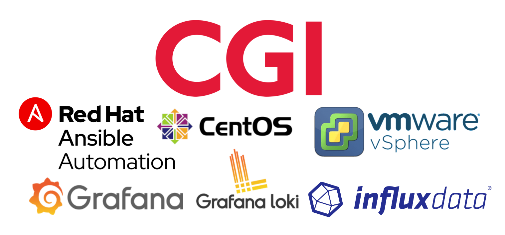
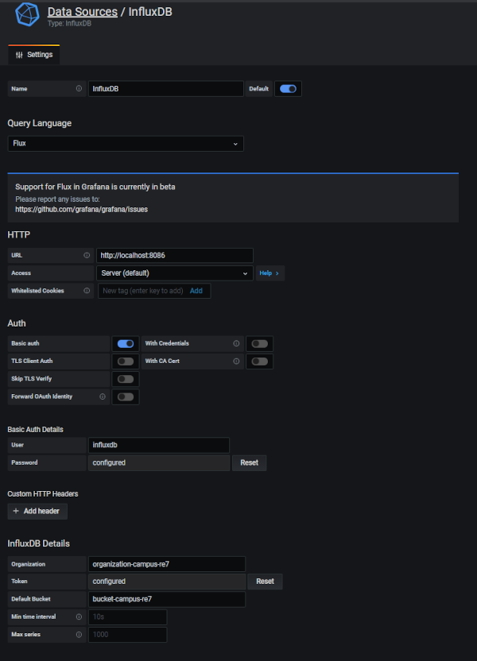

```{toggle}
---
title: |
  Automatisation dans un S.I et mise en place d'une Solution de Monitoring
  \
subtitle: |
  | Université de Bordeaux 
  | LPRO ADSILLH 2020
author: |
  | Marc Cenon
  |
  | marc.cenon33@gmail.com
  |
  | https://marc-cenon.github.io/my_resume/
date: 1 Septembre 2021
output: pdf_document
header-includes:
  - \usepackage{titling}
  - \posttitle{\end{center}}
  - \usepackage[usefilenames,DefaultFeatures={Ligatures=Common}]{plex-otf}
  - \renewcommand*\familydefault{\ttdefault}
---
\pagebreak
\tableofcontents
\pagebreak
```


----------------------------
rajouter les liens pour les diffents logiciels
les differentes licenses
faire une presentation des differents logiciels que Grafana va monitorer (1-2 pages)
bloc code playbook, enlever la premiere ligne ou mettre —
developper l'importation du dashboard
donner un exemple de filtre et lookup
quelques lignes sur les commandes ad-hoc pour verifier l'inventaire, ping, gather-fact
dans evolution, faire des sous-menu
###################
soutenance

20 min,
- 1 slide CGI - TEAM - CLIENTS
- 1 slide mes mission: dire que j'ai fait beaucoup de chose différentes et que le fils conducteur du stage est l'automatisation et que plutôt de parler de tous les playbook que j'ai fait, je présente un seul playbook avec tout ce qui tourne autour d'Ansible pour comprendre son fonctionnement
———- 5min pour l'intro
- Ansible : comment je suis venu à utiliser ansible et comment CGI s'ent sert et l'evolution future
- 1 slide pour la présenation de la solution de monitoring, les besoins et les attentes en terme de monitoring
- comment est articulé ce projet dire que les version sont choisi donc pas de yum latest, …
- ascenema demo sur le déroulement de l'installation du playbook et de son execution
- conclusion
------------------------------

# Remerciements

Tout d’abord, je voudrais remercier mon maître de stage, **Mr Thomas Coleno **. Il a su me faire confiance et a partagé ses connaissances de manière très pédagogique. Je le remercie aussi pour sa disponibilité et la qualité de son encadrement en entreprise.

Je tiens à remercier également **Mr. Arthur Bertinetti** et **Mr Laurent Poutou** pour leur patience et leur grande pédagogie. Ils ont su m’aider sur pleins de problématiques. 

J'ai pu ainsi bénéficier de leur grande expérience, ce qui m'a permis d'avoir une bonne monté en compétence.

En effet, chacune des personnes de l'équipe a su me consacre du temps et partager avec moi leur expertise, méthodes et connaissances tout au long de ce stage. Ils m’ont permis de rendre cette expérience de 6 mois enrichissante et pleine d'intérêt.

J'ai énormément appris. Ils m'ont fait confiance pour travailler avec eux sur pleins de projets et avec une grande autonomie et je les en remercie vivement.

Je les remercie également pour la bonne humeur qu'ils ont su me communiquer et l'envie qu'ils m'ont donné de travailler au sein de leur équipe.

Je tiens à remercier également le corps enseignant de l'Université, notamment **Mr Samuel Thibault** et **Mr Olivier Delmas** pour leurs soutiens et leurs enseignements. Ils m'ont permis de mener à bien ma reconversion professionnelle grâces à leurs conseils, à leurs excellents cours.

Ils ont toujours été très disponible et impliqué dans la réussite de chacun des étudiants de la promotion.

\pagebreak

# Introduction

Dans le cadre de la Licence professionnelle ADSILLH, j'ai effectué un stage de 6 mois au sein de l'équipe ENT / Local GOV dans la Bussiness Unit TPSHR dans l'entreprise CGI. 

Je vais vous présenter dans ce rapport l'entreprise qui m'a accueilli et plus précisément l'équipe où j'ai réalisé mon stage. Vous trouverez dans les annexes un tableau qui reprend les tâches sur lesquelles j'ai travaillé, semaine après semaine.

Etant donné la diversité des tâches réalisées, j'ai choisi comme thème de rapport de stage l'automatisation dans un S.I avec un focus sur le déploiement d'une solution de monitoring avec Ansible.

Aucunes données confidentielles ne seront présentées dans ce rapport.

Le but de ce stage était d'intégrer l'équipe Infrastructure afin de participer au développement du numérique à l'école ainsi que sur la gestion de cette infrastructure. Ce stage m'a permis d'apprendre et de manipuler des technologies comme Ansible, vSphere, Jira, Confluence, Python, Mariadb, Postgresql, Moodle, Big Blue Button, Jupyter, OpenStack, Kubernetes...

Au-delà du gain en compétences techniques, l'immersion au sein d'un processus de gestion de projet m'a appris à reconnaitre et interagir avec chacune des phases du projet sur le terrain. 

Cette immersion au sein d'un environnement complexe m'a également appris à être plus efficace, que ce soit par le biais d'une meilleure gestion de mon temps ou encore une meilleure communication sur l'avancement de mes tâches auprès de l'équipe que j'ai intégré.

Ce rapport est disponible sur mon github personnel en markdown:

```yaml
https://github.com/marc-cenon/rapport_de_stage/blob/master/rapport.md
```

Vous y trouverer le playbook que je vais présenter dans mon rapport. Ce PDF à été généré à partir du rapport en markdown grace à Pandoc et au fichier text.tex qui comprend les différentes variables pour le bon formatage de ce dernier.
Vous pouvez compiler le rapport avec la commande suivante, à condition d'avoir installé Pandoc.

```yaml
git clone https://github.com/marc-cenon/rapport_de_stage.git
cd rapport_de_stage
pandoc --listings -H text.tex rapport.md -o files/rapport.pdf --pdf-engine=xelatex
```
\pagebreak

# Partie 1
## Présentation de CGI

Fondé en juin 1976 par Serge Godin à Québec, Canada, CGI est un groupe canadien actif dans le domaine des technologies de l’information et en gestion des processus d’affaires. Au cours des dix premières années d’existence, CGI a développé une stratégie, un modèle et un ensemble de principes de gestion qui se sont traduits par une croissance considérable. Devant les demandes des clients d’externaliser leurs systèmes informatiques, CGI s'est adapté et à élaborer une nouvelle stratégie pour se positionner sur le marché émergent de l’externalisation.

Durant la fin des années 80 et début 90, CGI commença à acquérir des sociétés proposant des services d’externalisation. Dès lors, CGI est en mesure d’offrir à ses clients des services informatiques complets tels que des services en TI (Technologies de l’Information) et en gestion, des services d’intégrations de système et d’externalisation.

Dans les 20 dernières années, CGI chercha à atteindre une taille critique sur les marchés géographiques de ses clients, d’acquérir une croissance approfondie de leurs secteurs d’activités ainsi que de développer des pratiques spécialisées et des solutions novatrices.
En 2010, CGI fait l’acquisition de Stanley Inc. et de ses filiales Oberon et Techrizon dans le but de doubler la taille de ses activités aux États-Unis. Deux années plus tard, CGI réalisa sa plus grosse acquisition en fusionnant avec l’entreprise Logica faisant passer son nombre de collaborateurs de 31 000 à 68000.

Au cours de son histoire, CGI a réussi une expansion exponentielle et continue pendant 35 ans grâce à une stratégie de rachat et de conquête des différents marchés comme en témoigne le tableau ci-joint en Annexe relatant sa forte croissance en chiffre d’affaires, en nombre de bureaux et en nombre d’employés.

CGI est l'un des leaders mondiaux du conseil et des services numériques. Avec plus de 40 ans d'expertise et de savoir-faire et présent dans plus de 40 pays, le groupe CGI est implanté dans 21 villes en France avec environs 11 000 salariés.

L’entreprise est actuellement dirigée par trois personnes :
- Serge Godin : Fondateur et président exécutif du conseil,
- André Imbeau : Fondateur et membre du conseil d’administration,
- George D. Schindler : Président et chef de la direction.

Avec une présence dans 40 pays, une solide expertise dans tous ses marchés cibles et un éventail complet de service en IT, la priorité de CGI reste de satisfaire ses clients. Grace à une approche cohérente, disciplinée et responsable en matière de prestation de services, CGI affiche un bilan inégalé de 95% de projets réalisés dans le respect des échéances prévues et affiche un indice de satisfaction des clients qui est constamment supérieur à 9 sur 10. 
Ce score de satisfaction couplé à la croissance continue de CGI témoigne de la confiance que ses clients accordent à CGI et du dévouement de ses collaborateurs. 

Ceci dans le but de devenir un fournisseur de services complets, d’atteindre des résultats grâce à des ressources mondiales, à une connaissance approfondie de l’industrie, à une stabilité et des professionnels motivés. CGI possède maintenant 6 domaines d’expertises métiers qui sont le Business Consulting, l’intégration de systèmes, l’Outsourcing IT, les Services d’infrastructures, l’Application management et les Business procès services. 
Ces 6 domaines d’expertises sont répartis dans pas moins de 9 secteurs d’activités.


CGI est la cinquième plus importante entreprise indépendante en services IT et en gestion des processus d'affaires au monde au service avec plus de 10 000 clients dans le monde dont 500 en France.

Le groupe est composé de 70 000 membres répartis sur 400 bureaux répartis dans 40 pays dont 22 en France et réalise 7,6 milliards € de revenus mondiaux dont 1 milliard en France, au travers de projets intégration de système, d'outsourcing IT et également plus de 100 solutions exclusives soutenant les activités critiques de nos clients.

L’implantation de CGI en France résulte de la fusion de CGI avec Logica en 2012. Au niveau national, la filiale française de CGI est dirigée par Jean-Michel Baticle, entré dans le groupe en 1969. Son implantation dans la plupart des grandes villes françaises lui procure une implantation homogène pour couvrir l’ensemble du territoire métropolitain.

La structure de direction de CGI France est centrée autour des clients et chacune de ses activités sont regroupées au sein de Business Units qui sont au cœur même du modèle de CGI

## Le contexte de travail

En France, CGI est organisé en différentes Businness Unit: B.U. J'ai réalisé mon stage dans la BU TPSHR (transport, secteur public, ressources humaine), plus précisément dans le groupe Local GOV, au service des collectivités locales. 

Local Gov a pour but de proposer aux collectivités territoriales des solutions de services visant à faciliter le quotidien du citoyen, rendre les accès plus directs aux services et permettre un plus grand bénéfice de la dématérialisation.

Mon maitre de stage **Mr Thomas Coleno** ainsi que **Mr Laurent Poutou** et **Mr Arthur Bertinetti** m'ont accueilli dans leur équipe. Le contexte sanitaire actuel a fait que 99% de mon temps de travail été à distance. Grâce aux outils collaboratifs comme Teams et Slack ainsi que la visioconférence ont permis de pouvoir communiquer dans de bonnes conditions. 

Ce contexte m’a forcé à travailler sur mon autonomie. Cela a été pour moi très important car cela m’a poussé à chercher par moi-même et à solliciter mes collègues seulement en cas de difficultés.  Dans un sens, cela a été très formateur.

A partir du mois de Juillet, nous avons pu nous réunir une fois par semaine dans les locaux de CGI au Haillan.

Le fait de pouvoir télétravailler pour moi a été une réelle découverte comparée à mes postes précédant où, en tant que courtier en vin j’étais en déplacement constant et ne pouvais pas travailler depuis mon domicile.

Le télétravail m’a permis de trouver un certain confort pour équilibrer le contexte professionnel et personnel.

\pagebreak

## Mes missions

J'ai été recruté pour rejoindre l'équipe qui travaille dans le secteur de l'éducation nationale et particulièrement sur l'ENT: Espace Numérique de Travail, qui est utilisé par plusieurs régions de France. Cet ENT, très complet fournis des solutions clés en mains au collégiens et lycéens mais également aux professeurs et parents d'élève. 

Dans le contexte sanitaire actuel, l'équipe a dû s'adapter très rapidement pour fournir une solution performante et robuste afin de pouvoir supporter le fort développent du télé-enseignement. 

En annexe, vous trouverez un tableau qui reprend les principaux outils que l'ENT propose.

Je suis donc arrivé en Avril 2021 afin de pouvoir accompagner l'équipe en place dans leur travail au quotidien. Je peux définir mon travail durant le stage en 3 points :

- Rapport d'alarmes quotidien
.. Tous les jours je rédigé un rapport sur les alertes de la veille. Ce rapport utilise la solution de monitoring CENTREON, avec des sondes et des paramètres spécifiques à la surveillance de l'infrastructure. 

… Je relevé également les anomalies sur les différentes machines remontées par l’antivirus CLAMAV

-  Création de scripts d'automatisation avec Ansible.
.. Une bonne partie de mon travail a consisté à automatiser des tâches qui aurait été très chronophages. Mon tuteur **Mr Thomas Colenos** a une excellente maitrise de cet outil et il m'a permis d'apprendre en réalisant plusieurs scripts Ansible, particulièrement le déploiement d'une stack de monitoring que je présenterai dans la partie 2 de ce rapport.

-  Support de l'équipe sur diverses tâches.
.. J'ai eu la chance d'avoir un stage avec des missions très variés. Ce qui a été très formateur sur beaucoup de technologies différentes et avec des problématiques différentes.

Quelqu'uns des projets sur lequels j'ai pu participer:

- installation de machine BigBlueButton pour diverses region 
- creation d'un playbook Ansible pour le deploiment de la configuration de BBB
- creation d'un playbook Ansible pour le Monitoring
- creation d'un playbook Ansible Apache
- creation d'un playbook Ansible pour le deploiement d'un établissement de formation avec differentes briques logicielles
- Utilisation de Vsphere et NSXEDGE pour creer des vlan, firewall, loadbalancing, TLS, ...
- Creation de diverses machines: moodle, peertube, Drupal
- Monté en compérence BDD: Maria, PostgreSQL, InfuxDB
- Mise a jours de messageries Zimbra pour IDF, CRNA, CD77
- creation d'un playbook pour l'automatisation de la creation de VM dans VSPHERE


\pagebreak

## Présentation de l'ENT
- presentation de l'ENT
- les differents logiciels


# Partie 2
## Ansible et Automatisation

L'automatisation consiste à utiliser des logiciels pour créer des instructions reproductibles dans le but de remplacer ou de réduire l'intervention humaine. C'est un gain de temps et surtout cela permet de garantir le même résultat pour une opération réalisé n fois avec les mêmes paramètres : c'est le principe d'idempotence.

On passe du temps à écrire des règles d'automatisation mais une fois ces dernières testées et approuvées, on peut s'assurer du résultat et enlever les erreurs humaines (ex; faute de frappe,...)

L'automatisation est un élément clé de l'optimisation de l'environnement informatique dans un monde qui évolue rapidement, c'est donc un rôle essentiel.

Ansible est un outil libre qui sert à automatiser la gestion de la configuration, du déploiement et de l’orchestration. Ses points forts :

- pas d'agents à déployer sur les machines
- permet de déployer des configurations normalisées : la même configuration sur un grand nombre de machine
- permet de déployer des configurations plus spécifiques : on peut cibler une machine ou un groupe de machines
- utilisation de SSH pour communiquer les tâches d'exécutions sur les machines cibles (pas besoins d'ouvrir de ports spécifiques)
- utilisation de YAML comme langage
– Grande communauté. 
   Lancé en 2013 et acquis par Red Hat en 2015. Avec plus d’un quart de millions de téléchargements, il est actuellement l’outil d’automatisation de logiciel libre le plus populaire sur GitHub. 
- Ansible Galaxy: collection de playbook pour un grand nombre de tâches. Plus besoin de faire de script bash.
.. Pour des tâches comme installer un serveur NGINX, des rôles sont disponibles où seul un paramétrage des variables du playbook permet d'obtenir un résultat reproductible, prévisible et fiable.

Ansible permet d'automatiser la configuration à plusieurs différents niveaux (systèmes d’exploitation, composantes d’application), et peut être appliqué à différents équipements (serveur, stockage, réseau) ou infrastructures (Bare-metal, VM , Cloud). 

Ansible s'inscrit dans la mouvance IaC: Infrastructure as Code, c'est à dire gérer la configuration d'une Infrastructure à l'aide de fichiers de configuration stockable, versionable dans un flow CI/CD.

Avec le développement des Infrastructure Cloud, Ansible, couplé à des outils comme Terraform et Packer, permet de gérer un infrastructure Cloud en mode IaC.

Personnellement, je ne vois que des avantages dans ce mode de gestion IaC. C'est ce que j'utilise pour gérer mon homelab (Cluster sous Kubernetes de 8 raspberry pi).

Le fait de pouvoir redéployer son infrastructure et sa configuration grâce des fichiers de configuration est un atout majeur en cas de problème technique. Une réinstallation d'un service peut être réalisé rapidement.

## Différence entre Ansible et Script Bash

Les scripts Bash sont fréquemment utilisés pour configurer voire automatiser certaines actions. Ecrire des Script en Bash nécessite une bonne connaissance de ce langage de scripting.  De mon point de vue :

- Bash décrit des actions. (ex : copie tel fichier, réalise telle actions, n’autorise pas telle action ….)

- Ansible décrit « l’état désiré de la machine » (ex : ce fichier devrait être copié à tel endroit seulement si il n’y est pas déjà, ce service devrait redémarrer seulement si la configuration du service est modifiée, …)

Ansible, à l’inverse de Bash, se soucis plus de l’état que de l’action.  Il permet d’avoir une gestion de la configuration en mode déclarative et idempotente et permet une gestion fiable de l'exécution à distance, avec des nouvelles tentatives, logiques évolutive, …

De plus le fait de pouvoir relancer le même playbook plusieurs fois permet de surveiller les écarts de configuration. 

Si un utilisateur venait à modifier la configuration d’un service, le fait de repasser le script Ansible va permettre de remettre la machine à l’état décris dans le script Ansible.


## La solution de monitoring

Une de mes missions a été de mettre en place une solution de monitoring déployable par Ansible pour pouvoir surveiller l'infrastructure d'un client. La solution de monitoring retenue a été la suivante :

- Grafana pour la centralisation des graphiques
- Influxdb comme base de données pour les différentes métriques.
- Telegraf pour la collecte des métriques
- Loki pour la gestion des logs
- Promtail pour la récupération des logs


## La stack de monitoring

Cette solution, plus connus sous le nom de TIG (Telegraf - Influxdb -  Grafana) et de PLG (Promtail - Loki - Grafana) pour les logs, est une solution efficace, robuste, facilement scalable et extrêmement customisable.
Nous sommes sur une architecture logicielle sur 3 niveaux :

- la collectes des métriques et des logs
- le stockage des métriques dans la base de données Influxdb
- l'affichage des graphiques dans Grafana

\pagebreak

### Telegraf

```bash
https://github.com/influxdata/telegraf
```

Telegraf est un agent de récupération de métriques open source. Un seul agent est nécessaire par machine. Cet agent sait récupérer des métriques exposées et propose 2 modes de récupération :

- push : la métrique est poussée dans Telegraf par le composant qui l’expose
- pull : Telegraf récupère la métrique en interrogeant le composant qui l’expose (le mode le plus utilisé)

Les métriques sont par la suite insérées dans la Base de données Influxdb

Sa force réside dans la grande bibliothèque de plugins disponible afin de pouvoir récupérer les informations. Il peut récupérer des données dépuis des Bases de données, des IoT, des sondes (températures, pression de l'air,...) et des applications. 

C'est là que les plugins vont être très avantageux afin de parametrer facilement la récupération des informations.

Telegraf est écrit en GO et il est disponible dans un seul binaire sans besoins de dépendances ou besoin d'utilis des gestionnaires de paquets (npm, pip, gem, ...) 

Il est souvent associé à Influxdb (meme developpeur) ou Nagios, Prometheus, Graphite ou directement en JSON pour pouvoir être interpréter par un logiciel sur-mesure par exemple.


### Influxdb

```bash
https://github.com/influxdata/influxdb
```

Influxdb est une Time Series Database (TSDB) écrite en Go. Ce type de bases de données est employée notamment pour stocker et analyser des données de capteurs ou des logs sur une période donnée.
Ces données doivent être traitées rapidement une fois entrées dans la base de données. 

C’est pourquoi Influxdb intègre un service qui repose sur le protocole NTP Network Time Protocol, pour assurer que l’heure est bien synchrone sur l’ensemble des systèmes et que les logs sont bien traités.

Ces principaux avantages sont :
- les performances
- la durée de rétention importante
- la scalabilité

La societé qui developpe également Telegraf

### Loki

```bash
https://github.com/grafana/loki
```

Loki est un agrégateur de logs, facilement scalable et inspiré de Prometheus (un autre outil de monitoring qui peut remplacer Influxdb dans la stack). Loki utilise un mécanisme de découverte de service et ajoute des labels aux logs au lieu de les indexer, ce qui rend facile leur manipulation et ordonne leur stockage.

Les journaux reçus de Promtail se composent du même ensemble de labels que celui des métriques d'applications que Télégraf récupère. Ce qui permet une meilleure intégration des logs et des métriques.

De plus, Loki a besoin de peu de ressources pour fonctionner.


### Promtail
```bash
https://github.com/grafana/loki/releases
```

Promtail est un agent qui expédie les logs vers une instance Loki. Il est déployé sur chaque machine sur laquelle des applications doivent être surveillées. Il fonctionne en 3 temps :

- Découverte des cibles
- Attache des tags aux logs pour pouvoir les identifier et les rapprocher facilement
- Pousse les logs vers Loki.

Promtail est très customisable. Nous verrons plus loin un exemple de configuration.


### Grafana

```bash
 	github.com/grafana/grafana
```
Grafana est un outil supervision moderne. Il permet d'exposer sous formes de dashboards les métriques brutes ou agrégées provenant d’Influxdb et les logs provenant de Loki. L'une de ses grandes forces est qu'il permet de créer très facilement des seuils d’alertes et les actions associées comme l'envoie de mail pour alerter l'administrateur du S.I

Grafana fonctionne avec une WEBUI . Ce qui est très utile quand on veut monitorer une infrastructure à distance. Plus besoin d'installer de logiciels complets....

Il est distribué sous licence GNU Affero General Public License Version 3. Une version payante est egalement disponible ainsi qu'une version Cloud.
L'entreprise Grafana Labs propose egalement les solutions suivantes Open source:

  -  Grafana
  -  Cortex
  -  Graphite
  -  Loki
  -  Metrictank
  -  Prometheus
  -  Tanka
  -  Tempo
  -  k6


C'est pourquoi on trouve souvent le comba Grafana - Prometheus - Loki (du meme prestataire) + Influxdb et Telegraf

### Mise en place des différents éléments

Point Important : cette stack peut être très facilement installé grâce à Docker et par ailleur c'est l'une des solutions les plus utilisés pour monitorer des infrastructure Conteneurisé et dans le Cloud.

Personnellement, j'utilise cette solution conteneurisée, le tout orchestré avec K8S pour monitorer mon homelab.

Le choix fait par CGI et d'éviter la conteneurisation pour les environnements de production. Nous sommes donc partis sur une installation en dur des différentes briques de cette solution qui sera déployée par Ansible.

Etant donnée la nature sensible des informations, j'illustrerai par des graphiques de mon homelab et présenterez dans ce rapport seulement quelques morceaux que je juge important pour la compréhension du déploiement de cette solution de monitoring. 

En effet, Ansible utilise le format YAML qui permet une lecture facile des différents éléments du playbook.

Vous pouvez retrouver le Playbook dans son intégralité sur mon compte Github
Le playbook à été modifié afin de ne pas divulger d'information sensible. Il est fonctionnel, idempotent et peut être utilisé avec peu de modification pour monitorer sa propre infrastructure.

\pagebreak

### Infrastructure à surveiller

Cette solution de monitoring va surveiller plusieurs éléments d'une infrastructure d'une vingtaine de VM qui comprend :

- serveurs d'applications (Jupyter, Moodle, Drupal, Peertube, ...)
- serveurs web Nginx et Apache
- plusieurs BDD (MariaDB, MongoDb et PostgreSQL)

Etant donnée la composition de l'infrastructure, Telegraf qui sera déployé sur chaque machine, va pouvoir récupérer une grande variété de métriques tels que:

- statistique machines :

  - Mémoire
  - CPU
  - Uptime
  - Stockage
  - Disk I/O

- nginx:

  - load, network I/O
  - traffic
  - différentes requêtes
  - nombres de connexions

Dans un second temps, Télégraf pourra être reconfigurer très facilement pour monitorer les différentes base de données sur des critères tels que :

- erreurs
- SQL commands/sec
- Heatmap (queries/sec) cache

Promtail sera en charge de récupérer les logs suivants :

- logs système ( cron - access.log - audit.log ...)
- logs serveurs web ( seulement nginx pour le moment )
- logs applicatifs ( peertube, moodle pour le moment )

Tout comme Télégraf, Promtail pourra être reconfigurer pour récupérer les logs de différentes applications comme  Drupal, Jupyter, Wordpress, ...

\pagebreak

### Installation d'Ansible

Ansible est disponible pour un grand nombre de Distribution Linux. Il peut être installé par un gestionnaire de paquet ou par PIP car Ansible s'appuis majoritairement sur le langage Python.

Pour l'installer sur CentOS, il faut configurer le contrôleur en ajoutant le bon repository puis en installant le bon paquet, qui va se charger d’installer les dépendances necessaires

```shell
sudo yum install epel-release

sudo yum update

sudo yum install Ansible 
```

On vérifie la bonne installation d'Ansible et des dépendances :

```shell
Ansible –version

Ansible 2.9.6
  config file = /etc/Ansible/Ansible.cfg
  configured module search path = ['/home/marc/.Ansible/plugins/modules', '/usr/share/Ansible/plugins/modules']

  Ansible python module location = /usr/lib/python3/dist-packages/Ansible
  executable location = /usr/bin/Ansible

  python version = 3.8.10 (default, Jun  2 2021, 10:49:15) [GCC 9.4.0]
```


Ansible a besoin que le port SSH soit ouvert. Il faut vérifer que c'est bien le cas et également pour faciliter et sécuriser la communication SSH, il est recommandé d’activer l'authentification par clé plutôt que par mot de passe.

```shell
sudo firewall-cmd --list-services

dhcpv6-client mdns samba-client ssh
```
SSG fait bien partie des services actif dans le firewall

```shell
ssh-keygen

ssh-copy-id MACHINE_CLIENTE
```

Il est Également recommander d’accorder  les droits nécessaires à l’utilisateur qui exécutera les commandes Ansible. Cet utilisateur doit être présent sur les machines clientes.

```shell
echo “ UTILISATEUR_ANSIBLE ALL=(ALL) NOPASSWD: ALL” >> /etc/sudoers.d/UTILISATEUR
```

L’environnement de base est configuré.

\pagebreak

### Concepts de base


Avant de présenter le Playbook que j'ai réalisé, il est important de comprendre quelques éléments d'Ansible.
On définit des rôles, qui contiennent des tâches à exécuter à l'aide de différents modules, le tout regroupé dans un playbook, qui va réunir les différents rôles.  Comme précisé plus haut, tout est écrit en YAML.

Il existe de nombreux modules qui permettent de réaliser toutes les actions imaginables.
Ansible utilise également des templates, au format jinja2 afin de facilité la création de fichiers de configurations et la gestion des variables.

Il est de bonne pratique de créé un dossier par projet. Ce dossier va contenir plusieurs éléments. 

Voici un exemple simple d'arborescence d'un projet, que j'ai adapté depuis la documentation officielle d'Ansible:

```yaml
      
playbook.yml

inventory/
    group_vars/
       group1.yml            
       group2.yml
    host_vars/
       hostname1.yml          
       hostname2.yml
    staging.yml                  
    production.yml            

roles/
    common/               
        tasks/            
            main.yml      
        handlers/        
            main.yml      
        templates/        
            ntp.conf.j2   
        files/           
            foo.txt     
            bar.sh        
        vars/             
            main.yml      
        defaults/         
            main.yml      
        meta/             
            main.yml      
    webtier/              
    monitoring/           
```

Il est important de respecter une structure et de s'y tenir car un projet peut contenir rapidement beaucoup de fichiers. Un projet Ansible comporte les éléments suivants :

Un fichier Playbook qui va contenir l’ensemble des rôles et des tâches à executer.

Un dossier **inventory** :

... Il va contenir généralement les inventaires et les dossiers où sont stockés les variables.
... On peut avoir 2 inventaires par exemple, un staging.yml pour les test et un production.yml pour la production. 

Les inventaires sont des fichiers en .yml ou .ini qui regroupe la liste des machines. Une machine peut appartenir à un groupe de machine, ou plusieurs groupes, ou aucuns.
Les dossiers group_vars et host_vars sont des dossiers qui vont regrouper des variables qui seront appliquées à un group (group_vars) ou à une machine (host_vars).

Un dossier **rôle** avec des sous dossiers pour les différents rôles. Chaque sous dossiers peut contenir les sous-dossiers suivants :

- **/tasks/main.yml** : C’est ici que sont écrites l’ensemble des tâches que le rôle execute
- **/template/NOM_DU_TEMPLATE.j2** : le dossier template regroupe le/les templates necessaire pour le rôle
- **/handlers/main.yml** : un handler est une tache inactive qui sera active seulement si elle est invoquée dans le fichier /tasks/main.yml grâce au mot clé « notify »
- **/files** : ce dossiers contient les fichiers necessaire au fonctionnement du rôles comme des script bash, des liste csv, ….
- **/default/main.yml** : contient les valeurs des variables par défaut du rôle
- **/vars/main.yml** : contient d’autres variables, qui peuvent surcharger celle du /defaults/main.yml
- **/meta/main.yml** : contient les métadata sur le rôle (autheur, licences, dépendences, ….)

Les dossiers **/defaults** et **/vars** ne sont pas obligatoire car les dossier **group_vars** et **host_vars** servent à stocker les valeurs de variables.

## Quelques commande ad-hoc utiles

Ansible dispose de nombreuse commandes qui permettent de debuger, trouver des informations sur un module, executer une action rapidement et qui est employé rarement, sans le besoin d'écrire un role ou un playbook.

```bash
ansible-inventory --graph --vars
```

Cette commande va nous fournir la liste des hosts ainsi que les variables qui leurs sont attributé.


Le site D'ansible dispose de nombteuse information sur les modules et leur utilisation. Cependant une commande existe qui permet d'avoir de la documentation rapidement dans le terminal

```bash
ansible-doc
ansible-doc | wl -l
ansible-doc NOM_DU_MODULE
```
Avec ces commandes, on arrive a trouver beaucoup d'information sur les spécificités de chaques modules et avec des exemples. C'est l'équivalent de MAN mais pour Ansible. On peut copier de la fichier/dossier/archive sur toutes les machines avec une simple line de commande:

```bash
ansible NO_DU_GROUPE -m copy -a "src=/etc/hosts dest=/tmp/hosts"

ansible ALL -m ansible.builtin.yum -a "name=nginx state=latest"
```

Les commandes ad-hoc d'ansible on généralement la meme synaxe:
- ansible
- Nom du groupe de machine ou de la machine ou ALL pour tous ou UNGROUPED pour les machines sans groupes
- -m pour préciser le module que nous voulons utiliser, ici le module copy pour copier un fichier du controleur sur la/les machines ou yum pour installer nginx sur toutes les machines.
- entre parenthese les arguments du module a executer

Par défaut si nous ne précisons pas de module dans la commande, le module par défaut utilisé le command, qui permet de lancer des commande BASH (sans pouvoir utiliser la puissance du BASH comme le pipe, ...)

```bash
ansible all -a "free -m" 
```
Avec cette commande, on peut très rapidement obtenir des information sur la memmoire libre de toutes les machines. On comprend très vite le gains de temps pour faire du debuggage sur un parc de machine. En une commande on a recupere les information sur le parc de machines, sans avoir a faire de ssh et de taper la commande, sur chaque machine...

Une autre commande très utile pour un administrateur réseau:

```bash

ansible testserver -m listen_ports_facts -i prod-ansible-hosts
```
Ici, on utilise la puissance du module listen_ports_facts afin de trouver les informations sur les ports ouverts sur chaques machine. c'est l'équivalent d'une commande Netstat, SS ou NMAP.

Un autre exemple très utile:

```bash
ansible ALL -m setup
```

Cette commande va nous retourner enormement d'information sur les machines ou seront executer la commande. La sortie de cette commande est en JSON. Ce qui permets de pouvoir filtrer cette commande afin de recherche précisement une information. 


JSON est le format principal de sortie pour toutes les commandes d'Ansible.

## Execution du Playbook

La commande suivante permettra de déployer notre stack

```shell
Ansible-playbook playbook.yml -i inventory/host.yaml
```

Il est également possible de redéployer seulement un rôle en précisant le tag du rôle dans la commande ci-dessus. 

Ce qui donne par exemple :

```shell
Ansible-playbook playbook.yml -i inventory/host.yaml --tags="NOM_DU_ROLE"
```
\pagebreak

### Les différents rôles
### Grafana

Les étapes du rôle d'installation de Grafana sont simples. Avec l'aide des modules adéquats d'Ansible, les étapes pour l'installation et la configuration de Grafana sont les suivantes :

- création du groupe et du compte Grafana:monitoring
- création des dossiers nécessaires
- téléchargement du programme et extraction dans le dossier d'installation définie au préalable
- création d'un fichier de configuration grâce à un template
- import d'un Dashboard existant que j’ai créé
- ouverture des ports dans le firewall
- création du fichier .service à l'aide d'un template
- activation du service et redémarrage

Pour ce rôle, l'utilisation de template pour générer le fichier de configuration de Grafana et le service associé permettent de simplifier le processus d'installation. Cela permet également de pouvoir modifier rapidement et facilement le rôle en ajustant les variable adéquate dans le fichier /inventory/group_vars/all.yml. 

Voici la tasks du rôle Grafana qui utilise le template crée pour générer le fichier service:


```yaml
- name: "copy Grafana systemd service from template"
  template:                                     
    src: Grafana.service.j2                     
    dest: /etc/systemd/system/Grafana.service   
```

On utilise le module template, qui va chercher le fichier Grafana.service.j2 dans le dossier /role/Grafana/template/Grafana.service.j2 et qui va utiliser les valeurs définis dans le fichiers de variable dans /inventory/group_vars.

Voici le template utilisé pour créer le service :

```yaml
[Unit]
Description=Grafana
Wants=network-online.target
After=network-online.target
After=postgresql.service mariadb.service mysql.service

[Service]
Type=simple
User={{ Grafana_account_name }}
Group={{ Grafana_account_group }}
RuntimeDirectory=Grafana
RuntimeDirectoryMode=0750
WorkingDirectory={{ Grafana_main_folder }}/Grafana
ExecStart={{ Grafana_main_folder }}/Grafana/bin/Grafana-server
Restart=on-failure

[Install]
WantedBy=multi-user.target
```

Les parties intéressantes de ce template sont les parties entre accolade  **{{ }}**. La variable {{ Grafana_account_name }} va être populé par la valeur dans le fichier de variable dans **/inventory/group_vars/all.yml**


Bien que Grafana (comme Loki et Influxdb) sont installés sur une seule machine, afin de simplifier le playbook et pour eviter d’avoir trop de fichiers d’inventaire, un group comportant une seule machine, celle du monitoring est crée dans l’inventaire. De ce fait, nous pouvons définir les variables dans le seul fichier **/inventory/group_vars/all.yml** où se trouve la majorité des variables. Cela evite d’utiliser le dossiers **host_vars** et d’avoir un autre fichier avec des variables. 

Le risque est qu’avec trop de fichiers de variables, il peut être difficile de s’y retrouver et de savoir ou se trouver les bonnes variables, et de ne pas surcharger les variables par erreur car en fonction d’où se trouve le fichier qui contient les variables dans l’arborescence du projet, il y a une hierachie qui, si ignorée peut poser des problèmes.


Un des nombreux avantages d'Ansible est l'utilisation de loop 'boucle' pour répéter une même action dans une tâche avec des variables différentes. Voici un exemple pour l'ouverture des ports :


```yaml
- name: "open firewall port 3000 on the machine and port 25 for SMTP email"
  firewalld:                    
    state: "{{ item.state  }}"  
    port: "{{ item.port  }}"  
    zone:
    immediate:
    permanent: yes
  with_items:                   
    - { state: 'enabled', port:'3000/tcp'  } 
    - { state: 'enabled', port:'25/tcp'  }
```

Ici, on utilise le module **firewalld** et la une fonction **with_items** ( on peut également utiliser la fonction loop) qui va itérer sur les {{ item }} en appliquant les valeurs définis pour state et port, c’est-à-dire l’état et le port.

Avec ces quelques lignes, on ouvre les ports, dans la zone par défaut (car nous n'avons pas renseigné de zone spécifique dans zone), de manière permanente et immédiate.

\pagebreak

### Influxdb

Les étapes pour l'installation d'Influxdb sont sensiblement identique à celle de Grafana:

- création du groupe et du compte Influxdb:monitoring
- créations des dossiers nécessaires
- téléchargement du programme et extraction dans le bon dossier
- création d'un fichier de configuration et du service à partir d'un template
- ouverture des ports dans le firewall
- activation du service
- pause de quelques secondes, le temps que la BDD soit opérationnelle
- configuration d'Influxdb en passant une commande shell avec les paramètres définis dans le fichier de variable


La difficulté ici et la dernière étape pour automatiser la configuration d'Influxdb, on passe une commande shell, avec des arguments issus de variables définis dans group_vars/all.yml pour la création des éléments nécessaires à Influxdb. 


```yaml
- name: 'check if folder exist'
  stat:
    path: "{{ Influxdb_main_folder  }}/.Influxdbv2"
  register: folder_exist                                
                                                           
- name: 'configure Influxdb as Influxdb user and not root'
  become_user: "{{Influxdb_account_name}}"
  shell: >
    {{ Influxdb_main_folder  }}/Influxdb/influx setup --org {{ Influxdb_organization  }} --bucket {{ Influxdb_bucket  }} --username {{ Influxdb_username  }} --password {{ Influxdb_password  }} --token {{ Influxdb_token  }} --force
  when: not folder_exist.stat.
```

La condition **when** permet de s'assurer que le rôle se déroule bien car si on essaie de configurer la base de données alors que le dossier de configuration est déjà présent, la task va échouer et le playbook ne sera pas déroulé dans son intégralité.

L’un des principes d’Ansible, comme expliqué plus haut est l’idempotence. On peut lancer le playbook autant de fois qu’on le souhaite est rien de sera modifié si rien n’a changer dans le playbook car Ansible est axé sur l’état désiré de la machine et non sur l’action.

Le point que je souhaitais mettre en avant ici est la facilité avec laquelle on peut définir des conditions pour lancer, ou non des tasks sans grande connaissance en programmation.

La condition **when** nous est très utile car si on décide de modifier un paramêtre du playbook (autre que la bdd) et qu'on le relance, on aura une erreur car on essaie de faire executer une commande shell avec les même paramêtre pour la bdd, ce qui produit une erreur et interrompo le playbook. 

La condition ici nous permets de contourner ce problème et de redéployer le playbook avec la nouvelle configuration.

Le fonctionnement d’Ansible s’appuie sur des modules. Il se peut que dans certains cas la configuration d’un service ne peut se faire avec module. Ansible dispose de 3 modules qui vont permettre de contourner ce problème. Il s’agit des modules

- raw : exécute une commande de bas niveau. Très utile pour déployer de la configuration sur des machines dépourvu d’interpréteur, ou sur des machines spécifiques comment des switchs, routeurs,…

- shell: exécute une commande sur une machine distante dans un SHELL en s’appuyant sur les force du SHELL (ex : | n’est pas possible avec command)

- command: exécute une commande sur une machine distante

Dans le cas d’Influxdb, la configuration ne peut se faire qu’avec une commande SHELL et la condition WHEN permet de s’assurer que le playbook n’échoue s’il est relancé car la BDD est déjà configurée.


### Telegraf

Pour compléter notre stack TIG, il nous reste à déployer le rôle pour Telegraph. Il sera installé sur toutes les machines à surveiller. Les étapes du rôle sont les suivantes :

- création du groupe et du compte Telegraf:monitoring
- création des dossiers nécessaires
- téléchargement et extraction dans le bon dossier
- création d'un fichier de configuration et d’un service avec un template
- activation du service

Les étapes sont sensiblement les mêmes que pour Grafana et Influxdb. Le point important ici est le fichier de configuration. Une partie de la configuration sera la même pour toutes les machines : %CPU, %RAM, uptime, %SDD, ...

En fonction des spécificités des machines, la configuration sera à affiner pour récupérer des métriques spécifiques comme des métriques sur nginx, apache, mariadb, moodle, peertube, ...

Pour cela, 2 stratégies sont possibles :

- déployer la même configuration sur toute les machines et ajouter la configuration spécifique manuellement ... ce qui ne paraît pas logique quand on est dans une démarche d'automatisation avec une logique IaC.

- créer des sous dossiers dans group_vars ou host_vars (si déploiement d'une config spécifique à une machine) avec dedans un fichier avec les variables nécessaires à la configuration spécifique des machines.

 C'est le deuxième choix qui semble le plus avantageux et le plus logique d’un point de vue automatisation.

Quand il y a de la configuration spécifique à un groupe de machine, il suffit de définir les variables adéquates dans un fichier dans un dossier qui porte le nom du groupe de machine dans le dossier **group_vars**.

Par exemple, pour le groupe de machine Peertube, nous avons le dossier suivant : **inventory/group_vars/peertube**

Dans ce dossier le fichier **main.yml** comprend des valeurs de variable qui seront appliquées seulement aux machines du groupe Peertube, définies dans le fichier **/inventory/host.yml**.

Ainsi, on peut déployer en une seule fois une application, avec une configuration de base à toute les machines avec en plus une configuration spécifique à un groupe de machine.


C'est également ce fonctionnement qui sera utilisé pour le déploiement de la configuration de Promtail.


### Promtail

L'installation de Promtail suit le même schéma que Telegraf. Comme cet agent sera déployer sur toute les machines, il y aura un bout de configuration commune et un autre spécifique à un groupe de machine.

La configuration spécifique se trouve dans le même fichier que pour les configurations spécifiques de Télégraf.


### Loki

L'installation de Loki est identique à celle de Grafana et de Promtail. Il n'y a pas de difficultés majeures ou de point spécifique en mettre en avant.


### Le fichier playbook.yml

Le playbook var regrouper les différents rôles afin de les exécuter à la suite. Voici comment le rôle Grafana est appelé dans le playbook :


```yaml
- name: install Grafana
  remote_user: "{{ user  }}"  
  become: true                
  hosts: monit                
  tags: [Grafana]             
  roles:
    - role: install_Grafana  
```

Plusieurs éléments sont important quand on appelle  un role dans un playbook :

- remote_user : C’est l’utilisateur qui est utilisé pour se connecter a distance et effectuer les actions qui ne demande pas de privilège.
- become true : nous permets de passer root, ce dont nous avons besoins pour copier le fichier service dans le bon répertoire et pour l’activer.
- host : c’est le nom du groupe dans le fichier inventaire qui contient la machine.
- tags :  c’est ce qui va nous permettre si on en a besoin de lancher seulement ce rôle en specifiant le tag dans la ligne de commande d’Ansible.

On répète le même schéma pour les autres rôles.

\pagebreak

### le fichier host.yml

C'est l'un des fichiers les plus important. C'est dans ce dernier que l'on va définir la liste des machines que nous voulons intégrer à notre playbook. Il peut être au format **.ini** ou **.yml** 

Voici un exemple de fichier hosts qui est utiliser pour realiser des actions sur les machines spécifique:


```yaml
all:
  children:
    monit:                              
      hosts:
        monitoring-vm1:                  
          Ansible_host: 192.168.0.1     
    clients:                            
      children:
        bdd:                            
          hosts:
            moodle-bdd-vm1:
              Ansible_host: 192.168.0.2
            springboard-bdd-vm2:
              Ansible_host: 192.168.0.3
        nginx:                          
          hosts:
            springboard-nginx01:
              Ansible_host: 192.168.0.4
            springboard-nginx02:
              Ansible_host: 192.168.0.5
        apache:                         
          hosts:
            moodle-apache01:
              Ansible_host: 192.168.0.6
```

On a beaucoup de flexibilité et de modularité dans le fichier host pour créer des groupes et des sous-groupes. Cela nous permet de pouvoir déployer de la configuration avec une très grande précision et de cibler une machine ou un groupe de machines.


### Utilisation du langage Flux avec Influxdb

Influxdb est une base de données temporelle, à la différence des bases de données relationnelles comme MySql ou Mariadb. Ce type de base de données idéal quand on doit manipuler des données temporelles comme la mesure de la température du CPU toutes les 10 secondes. 
Ce type de BDD permet de traiter une très grande quantité d'informations, et dans un temps très courts, la gestion des données est différente à celle d’une base de données relationnelle. 

Les bases de données temporelles disposent de règles de retentions que l'administrateur décide afin de choisir la quantité d'information à stocker/recycler.

Depuis la version 2.0 D'Influxdb, le langage de requête InfluxQL a été remplacé par le langage FLUX, qui est plus performant et customisable.

Flux est une alternative à InfluxQL et à d'autres langages de requête de type SQL pour interroger et analyser des données. Il utilise des modèles de langage fonctionnels, ce qui le rend capable de surmonter bon nombre des limitations d'InfluxQL. Sa syntaxe est en partie inspiré de Javascript.

Quelques notion importante pour pouvoir écrire des requêtes avec Flux:

- utilisation de "pipe forward" |> pour enchainer des actions
- toutes les données sont structuré sous forme de tableau.
- Un regroupement de tableaux avec une politique de rétention est un Bucket. 

Voici quelques exemples de requêtes en langage FLUX:

Nombre de processus par machine:

```SQL
from(bucket: "bucket-vm")
  |> range(start: 2021-07-05T02:28:35Z, stop: 2021-07-05T08:28:35Z)
  |> filter(fn: (r) => r["_measurement"] == "processes")
  |> filter(fn: (r) => r["_field"] == "total")
  |> group(columns: ["host"])
  |> aggregateWindow(every: 20s, fn: mean, createEmpty: false)
  |> yield(name: "mean")
```


Utilisation du CPU par machine:

```SQL
from(bucket: "bucket-vm")
  |> range(start: 2021-07-05T02:29:36Z, stop: 2021-07-05T08:29:36Z)
  |> filter(fn: (r) => r["_measurement"] == "cpu")
  |> filter(fn: (r) => r["_field"] == "usage_system")
  |> filter(fn: (r) => r["cpu"] == "cpu-total")
  |> group(columns: ["host"])
  |> aggregateWindow(every: 20s, fn: mean, createEmpty: false)
  |> yield(name: "mean")
```

Influxdb dispose également d'une WEBUI qui permet de faciliter grandement la création de requêtes complexes. Il suffit de choisir les critères dans le menu et d'importer la requête dans Grafana, qui nous permettra de visualiser le résultat avec un graphique très customisable.

L'ensemble des requêtes du playbook est également disponible dans le fichier dashboard.json.

Flux est un langage très puissant mais le WEBUI d'Influxdb permet d'arriver au même résultat rapidement et de gérer les buckets et la politique de rétention des données très facilement. 

En effet, il est important de gérer la rotation du stockage des données car en fonction du nombre de machines, du nombre de critères de monitoring et de l'intervalle de récupération des métriques, le volume de donnée stocké peut rapidement être important.

\pagebreak

### Exemple de configuration de Promtail.

Afin de compléter notre stack de monitoring pour les logs, il faut configurer Promtail pour lui dire quels logs récupérer. C'est ce que l'on appelle "Scrape Job"

Voici un exemple de configuration de Promtail pour récupérer les logs de cron :


```yaml
#scrape job for cron log
- job_name: cron
  static_configs:
  - targets:
      - localhost
    labels:
      job: cron
      __path__: /var/log/cron
```

en voici un autre pour les logs nginx :
```yaml
- job_name: nginx
    entry_parser: raw
    static_configs:
      - targets:
          - localhost
        labels:
          job: nginx
          __path__: /var/log/nginx/*log
 ``` 
 
Une template est utilisé pour configurer les scrape jobs en fonction des différents groupes de machine. Le template est dans le dossier template du rôle Promtail et les variables sont définies dans les sous-dossiers qui portent le nom de chaque groupe, dans le dossier **group_vars**.

Attention : Il faut s'assurer que Promtail a les droits nécessaires pour lire les logs que nous voulons remonter dans Loki puis Grafana. Bien souvent les logs système sont définis avec un mod 640.

Il faut donc penser à configurer les autorisations nécessaires pour Promtail.


### Ajout des datastores dans Grafana

Une fois les agents Promtail et Telegraf configurés pour envoyer les données à Influxdb et Loki, il faut par la suite ajouter dans Grafana les data sources, c'est à dire Influxdb et Loki.

Cette action est réalisée dans les options de Grafana en lui indiquant le chemin d'accès pour Influxdb et Loki ainsi que les éléments d'identification necessaires. 

(Voir tableau en annexe)

\pagebreak

### Importation du dashboard

Le playbook contient également un Dashboard que j'ai créé précédemment et qui peut être réutilisé pour chaque nouveau déploiement. Il suffit de le charger dans le menu a gauche et nous avons les graphiques correspondant à chaque requêtes d'Influxdb.

(voir tableau en annexe)

Pour les logs, pour le moment il n'y a pas de dashboard de crée. Il suffit d'aller dans **explorer** puis de sélectionner Loki comme data source et nous pouvons trouver les logs que Promtail à récupérer.

(voir tableau en annexe)

### Utilisation de Grafana

Grafana permet de créer des alertes en fonction de critères choisis par l'administrateur. On peut par exemple définir l'envoi d'un mail lorsqu’un seuil est franchi.

C'est très utile pour surveiller l'espace disque. L'administrateur va définir un seuil d'alerte (ex: 80% Plein) et quand il est atteint, un mail est envoyé.

Plutôt qu'un mail, il est possible de créer des alertes dans Teams, ou Slack en configurant des webhooks.


### Exemple de configuration pour une alerte

Grafana inclut un server SMTP qu'il faut paramétrer dans son fichier principal de configuration. Afin de simplifier les changements de configuration et pour éviter de devoir réécrire des rôles pour modifier le fichier de configuration, il est plus simple et pratique d'utiliser un Template pour modifier ce dernier.

Dans le rôle d'installation de Grafana, j'utilise une task qui créer le fichier de configuration selon ce que j'aurai défini dans le fichier de Template.

Voici le task que j'ai utilisé et qui va créer le fichier de configuration avec la bonne configuration :

```YAML
- name: "create custom Grafana configuration file from template"
  template:
    src: Grafana_conf.j2
    dest: "{{ Grafana_main_folder  }}/Grafana/conf/custom.ini"
    mode: 0755
    owner: "{{ Grafana_account_name  }}"
    group: "{{ Grafana_account_group  }}"
  notify:
    - restart Grafana
```

Voici une partie de la configuration du serveur SMTP dans le Template :

```SHELL
########## SMTP / Emailing ##########
[smtp]
enabled = true  <- pas de variable ici car on veut qu'il soit activé quel que soit la configuration
host = localhost:25
from_address = "{{ Grafana_email  }}" <- une variable ici dans l'éventualité où on voudrait changer l'addresse d'envoi du mail
from_name = Grafana-monitoring
```

Le serveur étant configurer, il ne reste plus qu'a configurer les alertes dans Grafana. Par exemple, j'ai défini les alertes suivantes pour la surveillance de mon cluster :

- Température des CPU
- Utilisation des CPU
- Utilisation de la Mémoire
- Surveillance des nodes du cluster

(Voir annexe pour tableau)

Pour surveiller l'utilisation de la mémoire, il suffit d'écrire une requête qui va déclencher l'envoie d'un mail si l'utilisation de la mémoire dépasse 85%.


Le WEBUI de Grafana facilite grandement la création d'alertes.

Voici un exemple de requête :

```SQL
Rule Name Memory Usage alert
Evaluate every 60s For 0m

Conditions
WHEN max () OF query (B, 5m, now) IS ABOVE 0,85
No Data & Error Handling

Alerting
Notifications Send to marc.cenon33@gmail.com
Message: alerte dépassement mémoire
```

(Voir Image en annexe)

Un outil de monitoring n'est utile que s’il est bien configuré. Un AdminSys ne va pas passer son temps à regarder des graphs de monitoring. 

En créant des alertes sur des points importants, on va recevoir une notification afin d'agir sur le problème et d'être plus efficace sur d'autres tâches de travail.

Cela peut également nous permettre d’anticiper certaines actions comme par example l’ajout d’un disque en LVM. En Surveillance l’espace libre d’un SDD et en mettant une alerte, il est possible de planifier une action d’ajout d’espace disque plutôt que de devoir le faire en urgence au dernier moment.

Cet outil de monitoring nous permet d’avoir une grande visibilité sur l’infrastructure et sur les actions à entreprendre pour anticiper les problèmes.

\pagebreak

## Rendre le service accessible depuis l'extérieur

Le dernier point important de ce projet à été de rendre Grafana accessible depuis l'extérieur afin d'avoir accès au monitoring même en dehors du réseau interne. 
Plusieurs éléments étaient à prendre en compte pour y arriver :

### Configuration d'OVH

CGI utilise OVH pour la majeure partie de son infrastructure. J'ai dû configurer :
- Dans la zone dns, la création d'une entrée A qui lie une ip publique au nom de domaine choisi pour accéder à Grafana 

### Configuration dans Vsphere:

L'infrastructure tourne sous ESXI avec NSX et Vsphere pour fournir une interface graphique et les API REST pour la création, la configuration et la surveillance des composants tels que les contrôleurs, commutateurs logiques, ....

Grâce à Vsphere et NSX, on peut configurer depuis un navigateur Web les VM, Firewall, Règles NAT, LoadBalancing, Vlan, .... 
C'est avec cet outils que j'ai créé la VM de Monitoring où est installé Grafana - Influxdb - Loki (ainsi que Telegraf et Promtail pour exposer les informations de la machine de monitoring dans Grafana.)

Sans rentrer dans les détails car ce n'est pas le sujet de mon mémoire, voici les étapes principales pour la configuration de la VM:

- Création de la VM sours CentOS 7:
  - création de la VM avec suffisament de CPU + RAM pour faire tourner les applications confortablement
  - configuration du LVM (Logical Volume Manager) avec un disque dur de 50 Go monté en /appli, formaté EXT4 où sont installé les applications

- Configuration du VLAN:
  - création d'un commutateur logique
  - création d'un profil de protocole réseau sur le bon datacenter
  - définition de la plage d'IP pour le VLAN
  - configuration du contrôleur pour accéder au nouveau VLAN

- Configuration des règles dans le firewall
  - Ajout d’un dispositif NSX Edge Services Gateway
  - Selection de la taille du dispositif (nombre de Vcpu, Ram, HDD, …)
  - Configuration de l'interface principale avec son addresse IP Principale
  - affectation au bon VM Network
  - Configuration de la Passerelle
  - Rajout des Certificats WildCard dans la configuration du firewall NSX Edge
  - Ajout de l'interface pour que le controleur puisse acceder aux machines qui seronts dans le Firewall
  - Creation du groupe d'IP
  - Création des règles d'entrée/sorties (IPTABLE)
  - Configuration des règles NAT
    .. Il faut configurer les règles NAT (DNAT et SNAT) afin de permettre la bonne traduction de l'IP privée + port/service -> IP public + port/service.

Une fois ces étapes terminées, nous pouvons accéder à Grafana sur la bonne url en TLS.

\pagebreak

## Evolution et amélioration

### Utiliation D'ansible Galaxy pour Installer un reverse proxy NGINX

Dans ce schéma d'installation, les différentes briques sont installés et la configuration TLS est supporté par NSX Edge dans Vsphere. Le playbook dans son état actuel permet de déployer la stack de monitoring sans support TLS (car géré par NSX Edge ). Il peut être intéressant d'installer un reverse proxy du type Apache ou Nginx afin de ne pas exposer trop de port et de gérer les certificats sur la machine. 

Je choisi d'installer NGINX. Pour cela, nous pouvons modifier notre playbook de 2 façons :

- Écrire un rôle qui va installer et configurer. Cela peut être une bonne solution lorsqu'on a une configuration atypique mais cela peut demander du temps pour l'écrire.

- Utiliser un des nombreux rôles disponibles dans Ansible Galaxy et simplement modifier les variable nécessaire pour la configuration des services.

Je fais le choix d'utiliser la deuxième option. Cela me permet de tirer bénéfice d'Ansible Galaxy sans avoir à réécrire un rôle en entier. Je vais le choix d'utiliser le rôle de geerlinguy. Dans un premier temps, je télécharge le rôle depuis Ansible Galaxy:

```bash
ansible-galaxy install geerlingguy.nginx
```

Dans mon playbook, j'ai besoin d'appeler ce nouveau rôle:

```bash
- hosts: monit
  roles:
    - { role: geerlingguy.nginx }
```

De cette façon, le rôle sera exécuté sur la VM ou sont installés Graphana, Influxdb et Loki. Ce rôle dispose d'un fichier /defaults/main.yml. Il est très bien documenté et permet de comprendre rapidement les variables que nous devons utiliser. 

Nous avons juste besoin de créer la configuration nécessaire pour Grafana et InfluxdB.

Dans ce fichier, nous avons besoin de configurer les vhosts et nous pouvons donner une liste d'argument dans la variable nginx_vhosts:. Voici ce que nous pouvons lui ajouter par exemple.

```bash
nginx_vhosts:
  - listen: "443 ssl http2"
    server_name: "grafana.support-ent.fr
    root: "/appli/monitoring/grafana
    index: "index.php index.html index.htm"
    access_log: "/appli/monitoring/logs/access_log"
    error_log: "/appli/monitoring/logs/error_log"
    extra_parameters: |
      location ~ \.php$ {
          fastcgi_split_path_info ^(.+\.php)(/.+)$;
          fastcgi_pass unix:/var/run/php5-fpm.sock;
          fastcgi_index index.php;
          fastcgi_param SCRIPT_FILENAME $document_root$fastcgi_script_name;
          include fastcgi_params;
      }
      ssl_certificate     {{ my_certts_pem }};
      ssl_certificate_key {{ my_certs_key }};
      ssl_protocols       TLSv1.1 TLSv1.2;
      ssl_ciphers         HIGH:!aNULL:!MD5;
  - listen: "80 default_server"
    servername: "grafana.support-ent.fr"
    return 301 https://$server_name$request_uri;
```    
    
Ici, je défini les vhost en 80 avec redirection automatique ainsi que le vhost en 443. Les certificats sont référencés en variables. Il ne reste plus qu'à relancer le playbook. Vu que la seule modification et l'ajout du rôle nginx, les autres taches apparaitrons en **OK** car aucun changement n'est réalisé. 

Sur le rôle nginx, les taches apparaîtrons en **changed** car il y a eu un changement. Le rôle va également vérifier la configuration du nginx, redémarrer le service grâce à un handler.

Une fois l'exécution terminée, nous pouvons accéder à Grafana en HTTPS sans avoir à passer par NSX Edge.
Une autre évolution possible sera de gérer la montée de version automatiquement. Cela peut être dangereux et causé des problèmes sur des infrastructures importantes. C'est pourquoi nous testons d'abord sur un environnement de pré-production avant de passer à la production.

Il sera également intéressant de créer un Dashboard pour l'analyse des logs ainsi que la mise en place d'un système d'alerting. Comme Loki est développé par les même développeurs que Grafana, la mise en place d'un tel système est identique à celle décrite plus haut.

Comme un Git interne à CGI existe, Le Playbook est versionné afin de facilité la collaboration avec les autres utilisateurs et de gérer les changements, monté de version ainsi que le déploiement par client.

\pagebreak

## Conclusion sur ce projet
configuration d'un dashboard pour les logs

Nous avons ici un systeme de monitoring complet (métriques + logs système et applicatifs) avec des graphiques facilement compréhensibles et avec un système d'alerte en place. Ce qui est rassurant pour l'administrateur qui a définit ses seuils d'alertes afin de se laisser une marge de temps pour agir en conséquence.

En plus, comme Grafana est accessible depuis un simple navigateur internet, cela permet à l'Administrateur de pouvoir surveiller à distance l'infrastructure.

Cela a été pour moi un projet très enrichissant car j'ai pu construire sur des bases que j'avais en Ansible pour arriver à produire un script fonctionnel avec plusieurs briques logiciels. J'ai rencontré certaines difficultés dans la compréhension du fonctionnement de certain module d'Ansible mais en persévérant et avec l'aide de **Mr Thomas Colenos** et **Mr Arthur Bertinetti** j'ai pu réussir mes tâches.

Ansible est une technologie qui m'intéresse beaucoup et je suis très content d'avoir pu travailler dessus durant mon stage. J'ai par la suite créé d'autres script Ansible du type :

- installation / Configuration d'un serveur Apache
- Configuration d'un pool de machine Big Blue Button
- Déploiement d'une infrastructure complexe ( nginx, apache, drupal, mariabd, moodle, python )

Sur cette dernière j'ai rencontré des difficultés sur certains points. Mon responsable a pu utiliser une partie du travail que j'ai fait pour arriver à un script qui fonctionne. Grâce à lui, j'ai appris de mes erreurs et pu grandement et efficacement améliorer mes compétences en Ansible.

\pagebreak

# Conclusion 

Ce stage correspondait parfaitement à ce que je recherché. Il m'a permis d'apprendre et de perfectionner certaines de mes connaissances, notamment tout ce qui touche à l'automatisation, au scripting, et à la gestion de plusieurs VM. J’ai également pu faire un peu de programmation en Python. 

Sur ce derniers point, j’ai encore beaucoup de travail à faire car je n’ai pas les connaissances suffisante pour pouvoir travailler efficacement avec ce langage mais je pense qu’il est important de savoir exploiter ce langage qui est un excellent langage de scripting pour tout AdminSys.


Ce stage au sein d'une grande entreprise de service numérique de renommée mondial fut une expérience très enrichissante tant sur le plan personnel que professionnel. Cela m'a permis de conforter mon envie de travailler dans le secteur informatique en tant que DevOps. A 33 ans, en reconversion professionnelle, il faut être conscient de ses forces et faiblesse et je pense que j'ai fait le bon choix d'écouter ma passion pour en faire mon métier.

Le contexte actuel sanitaire a fait que j'étais en télétravail 99% du temps, ce qui ne rends pas forcement les choses faciles pour encadrer un stagiaire. **Mr Thomas Colenos** à parfaitement su me superviser et m'apporter l'aide nécessaire quand j'en avais besoin. Il m'a laissé une grande autonomie et m'a permis de progresser énormément.


En parallèle de ce stage, j'ai choisi de passer des certifications afin de valider mes compétences. J'ai obtenu une certification en cybersécurité (Comptia Security +), une certification sur Kubernetes (CKA: Certified Kubernetes Administrator) et je passe fin Septembre la certification RHCE (Red Hat Certified Engeneer). 

Cette dernière certification est le prolongement logique de ce que j’ai fait durant mon stage. Elle est très pointue et elle est orientée sur l’automatisation et la très bonne maitrise d’Ansible pour administrer un S.I.

Pour terminer, j'ai eu une proposition d'embauche en CDI en tant que Cadre Ingénieur et j'ai accepté. Je vais pouvoir évoluer au sein d'une équipe dynamique, sur des projets et des technologies intéressantes.

\pagebreak

# Annexes

A rajouter tableau des outils ENT





\pagebreak

- tableau du travail semaine par semaine

Récapitulatifs des tâches réalisées

|semaine| actions |
|-------- | ------------- |
|Semaine 1| repérage, prise en main de l'infrastructure <br />  et des outils de travail | 
|Semaine 2| creation de machines BBB <br />  et configuration (Openstack - BBB) | 
|Semaine 3| creation de machines BBB <br />  et configuration (Openstack - BBB) | 
|Semaine 4| scrit Ansible pour la modification <br />  de la configuration des BBB | 
|Semaine 5| script Ansible Monitoring grafana influxdv promtail loki | 
|Semaine 6| script Ansible Monitoring grafana influxdv promtail loki <br />  + redaction documentation Ansible | 
|Semaine 7| script apache | 
|Semaine 8| script bash, python et ansible | 
|Semaine 9| script python et ansible _ suppression mail Zimbra | 
|Semaine 10| script Ansible pour le déploiement <br /> Nginx, Apache, Moodle, Drupal, Mariadb, Python |
|Semaine 11| script Ansible pour le déploiement <br /> Nginx, Apache, Moodle, Drupal, Mariadb, Python |
|Semaine 12| script Ansible pour le déploiement <br /> Nginx, Apache, Moodle, Drupal, Mariadb, Python |
|Semaibe 13|  script Ansible pour le déploiement <br /> Nginx, Apache, Moodle, Drupal, Mariadb, Python |
|Semaine 14| Creationde VLANS dans VSPHERE et NSX Edge, firewall, <br /> et VM - installation de Jupyter hub |
|Semaine 15| renouvellement certificats sur vm et sur NSX Edge, <br /> creation de vm Moodle et Jupyter |
|Semaine 16| Creation de moodle preprod et prod pour <br /> la region Normandie (Postgres, Apache, Moodle) |
|Semaine 17| Montée en version de Peertube pour GDA et CRIF, <br /> Mise à jour docker Riot pour CRNA, mise en place d'un Jupyter Hub sous Kubernetes | 
|Semaine 18| Création d'un proxy pour BBB, configuration php pour moodle, NSX Edge, troubleshooting Jupyter |
|Semaine 19| Montée en version de Moodle, Ansible pour mise à jours Zimbra, <br /> modification des specs des machines Zimbra dans Vsphere, Mise en Place de Jupyter Hub sous Kubernetes |

\pagebreak
